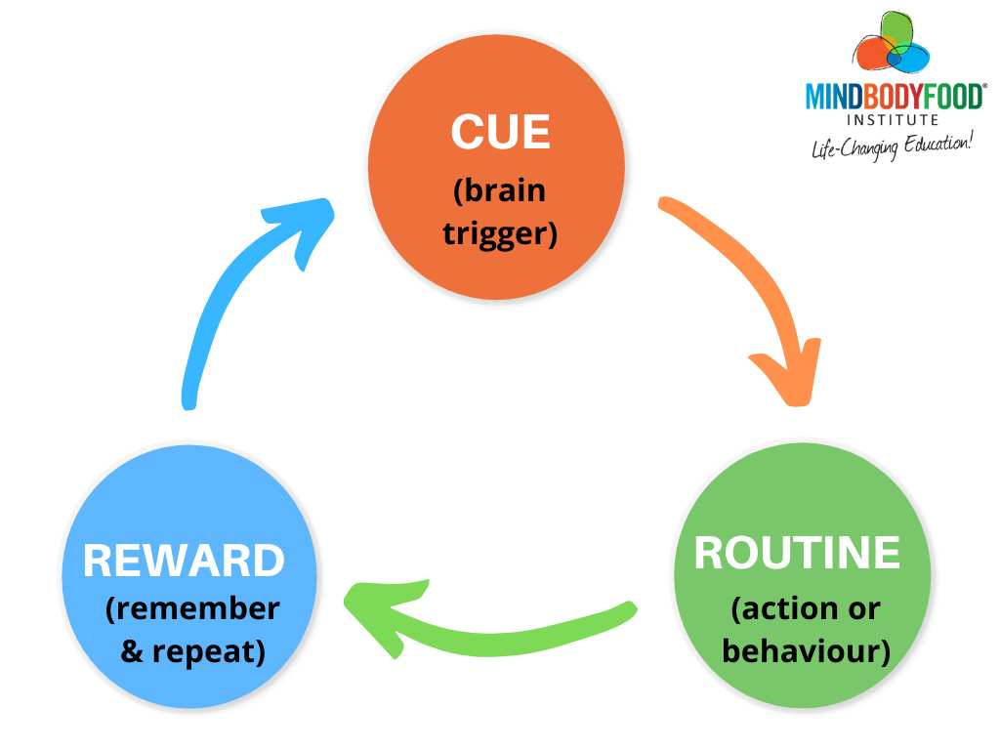
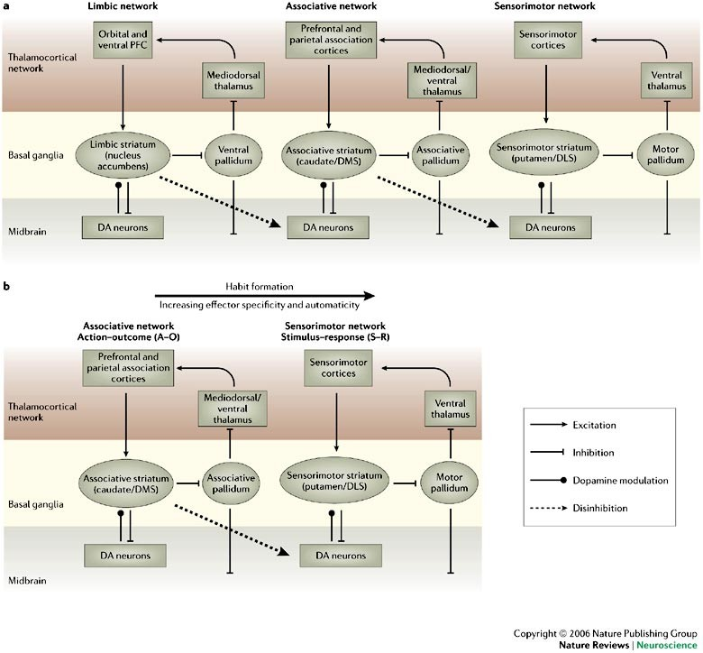
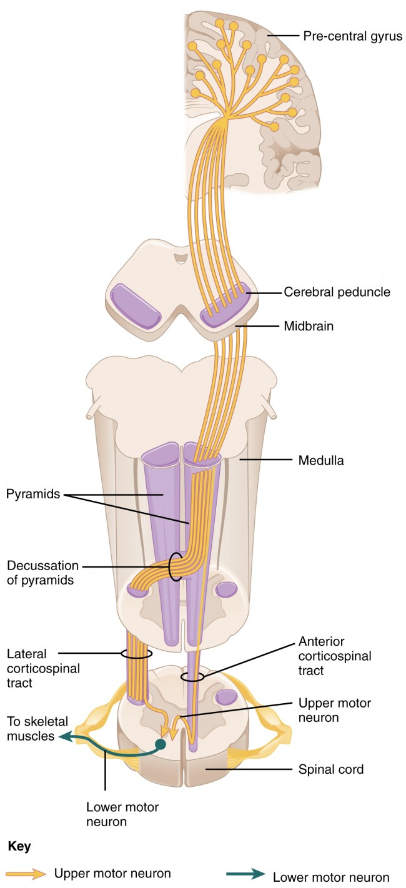
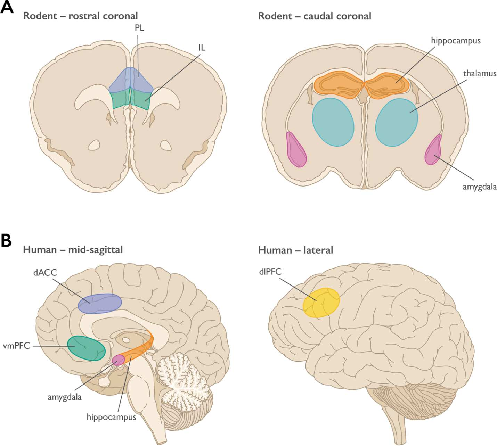
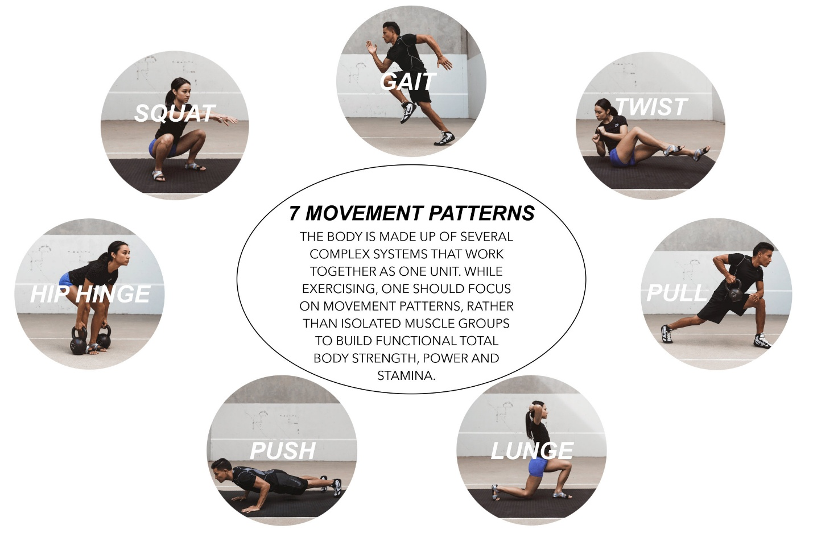

# Behavior Loops: How the Body Learns (and Why It Gets Stuck)

> **Core Thesis**: Your body does not repeat patterns because they are correct. It repeats patterns because they are efficient. Efficiency—not correctness—is the nervous system's primary goal. This is the missing link between posture, pain, and relapse.

---

## Quick Reference

| Principle | Insight |
|-----------|---------|
| **Why patterns repeat** | Efficiency, not correctness |
| **Loop structure** | Cue → Program → Outcome → Reinforcement |
| **Why pain persists** | Pain can become part of the loop |
| **Why effort fails** | Conscious override exhausts quickly |
| **How to change** | Safety first, then repetition |

---

## The Core Behavior Loop (Nervous System Level)


*The habit loop: stress (cue) triggers routine (behavior), which produces reward (relief), reinforcing the pattern.*
*(Source: Chapter 6 - Behavior Loops, Page 71)*

Every habit—movement, posture, or pain response—follows the same loop:

```
Cue → Program → Outcome → Reinforcement
         ↑                      |
         └──────────────────────┘
```

| Component | What It Is |
|-----------|------------|
| **Cue** | Sensory input (pressure, fatigue, stress, imbalance) |
| **Program** | Stored motor pattern |
| **Outcome** | Movement / posture / pain |
| **Reinforcement** | Relief, stability, or energy savings |

Once reinforced, the loop runs **automatically**.

> "The body doesn't ask if a loop is good. It asks if it works."

---

## Why Pain Becomes a Habit (Not Just a Symptom)

Pain often becomes **part of the loop itself**.

### Example Pain Loop:

```
Cue: Load or stress
    → Program: Protective tension
    → Outcome: Reduced motion + pain
    → Reinforcement: Avoided perceived danger
```

The nervous system learns: **"Pain = safety."**

Even when tissues heal, the loop remains.

> "Chronic pain is often a learned protective behavior."

---

## Motor Loops Collapse Into Single Commands


*As habits form, control shifts from goal-directed associative networks to automatic sensorimotor networks.*
*(Source: Chapter 6 - Behavior Loops, Page 70)*

Complex actions don't stay complex.

### With Repetition:

| What Happens | Result |
|--------------|--------|
| Multiple muscle commands collapse | Single trigger activates all |
| Sequences compress | Whole pattern runs at once |
| Conscious effort disappears | Automatic execution |

### This Is Why:

- You don't think about walking
- You don't think about sitting
- You don't think about slouching

**Your posture is a single keystroke, not a checklist.**

---

## Why "Trying Harder" Makes Things Worse


*Motor commands travel from pre-central gyrus through pyramids and medulla to spinal cord and skeletal muscles.*
*(Source: Chapter 6 - Behavior Loops, Page 75)*

When conscious control interferes with automatic loops:

| What Happens | Effect |
|--------------|--------|
| Energy cost spikes | Fatigue accelerates |
| Coordination degrades | Movement quality drops |
| Threat perception increases | Body feels unsafe |
| Old loops reassert | Pattern returns |

### The Familiar Cycle:

```
"I can hold it..." → "I'm tired..." → "...it's back."
```

> "Effort cannot override automation."

---

## The Safety Gate (Why Loops Don't Change Easily)


*The safety gate: amygdala (threat detection), hippocampus (memory), and prefrontal cortex (executive control) evaluate whether change is safe.*
*(Source: Chapter 6 - Behavior Loops, Page 80)*

Before any loop updates, the nervous system asks one question:

**"Is this safe?"**

### If the Answer Is "Maybe":

| Response | Result |
|----------|--------|
| Old loop stays | No update |
| New pattern is rejected | Change blocked |
| Pain increases | Enforce compliance |

### This Is Why:

- Stretching feels threatening
- "Good posture" feels exhausting
- New movement feels unstable

> "Safety precedes change. Always."

---

## How Behavior Loops Actually Rewrite


*Seven fundamental movement patterns: squat, hip hinge, lunge, push, pull, twist, gait—all learned through repetition.*
*(Source: Chapter 6 - Behavior Loops, Page 82)*

Loops update when the nervous system accepts a new pattern as **safe and efficient**.

### Requirements for Loop Rewriting:

| Requirement | Why It Matters |
|-------------|----------------|
| Safety established | Threat perception must drop |
| Success repeated | New pattern must work |
| Energy acceptable | Must not cost too much |
| Context stable | Environment must feel predictable |

### The Rewrite Sequence:

```
New input → successful outcome → repeated success → safety confirmed → automation
```

---

## Loop Rewriting vs. Loop Overriding

| Approach | What Happens | Duration |
|----------|--------------|----------|
| **Override** (conscious effort) | Fight existing loop | Minutes to hours |
| **Rewrite** (new learning) | Replace existing loop | Permanent |

### Override Fails Because:

- Conscious control has limited bandwidth
- Fatigue degrades willpower
- Stress triggers old patterns
- Sleep resets to familiar programs

### Rewrite Succeeds When:

- New pattern feels safe
- New pattern saves energy
- New pattern repeated enough
- Old pattern becomes unfamiliar

---

## Why Relapse Happens

Relapse is not failure. It is **loop protection**.

### Triggers for Loop Reactivation:

| Trigger | What Happens |
|---------|--------------|
| Stress | Old safety patterns activate |
| Fatigue | Energy conservation kicks in |
| Injury | Protective patterns return |
| Context | Environment triggers old loops |

### The Path Back:

```
Stressor → threat detected → old loop activated → "relapse"
```

**This is the system working correctly—just not how you want.**

---

## Clinical Implications

### For Practitioners:

| Instead of... | Try... |
|---------------|--------|
| Forcing correction | Creating safety |
| Adding exercises | Reducing threat |
| Fighting compensation | Understanding its purpose |
| Demanding compliance | Building trust |

### For Patients:

| Instead of... | Try... |
|---------------|--------|
| "I should be able to..." | "My body is protecting something" |
| "I'm not trying hard enough" | "Effort isn't the answer" |
| "Why can't I just..." | "What does my system need to feel safe?" |

---

## The Loop Liberation Process

### Step 1: Identify the Loop

| Ask | What It Reveals |
|-----|-----------------|
| What's the cue? | What triggers the pattern |
| What's the program? | What runs automatically |
| What's the reinforcement? | What maintains the loop |

### Step 2: Address Safety First

- Reduce threat perception
- Establish stability
- Create successful experiences

### Step 3: Introduce New Pattern

- Must be simple
- Must succeed immediately
- Must feel safe

### Step 4: Repeat Until Automatic

- Frequency matters
- Context matters
- Success rate matters

---

## Key Quotes

> "Your body does not repeat patterns because they are correct. It repeats patterns because they are efficient."

> "The body doesn't ask if a loop is good. It asks if it works."

> "Chronic pain is often a learned protective behavior."

> "Effort cannot override automation."

> "Safety precedes change. Always."

---

## See Also

### Nervous System Concepts
- [Pain as Signal](pain-as-signal.md) - Pain as neural event, signal persistence
- [Posture as Program](posture-as-program.md) - Posture as automated software
- [Body as System](body-as-system.md) - Multi-system integration

### Related Structures & Cases
- [Joint Centration](../structures/joint-centration.md) - How joint position affects loops
- [Kinetic Chain](../structures/kinetic-chain.md) - Connected movement patterns
- [Case Studies](../case-studies/) - Clinical examples of loop rewriting
