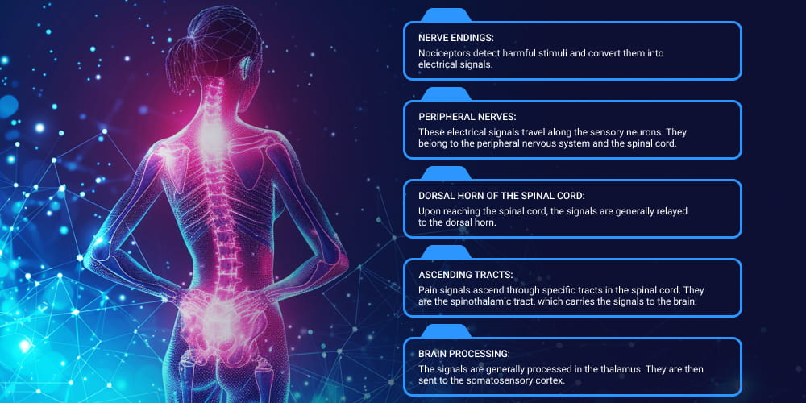
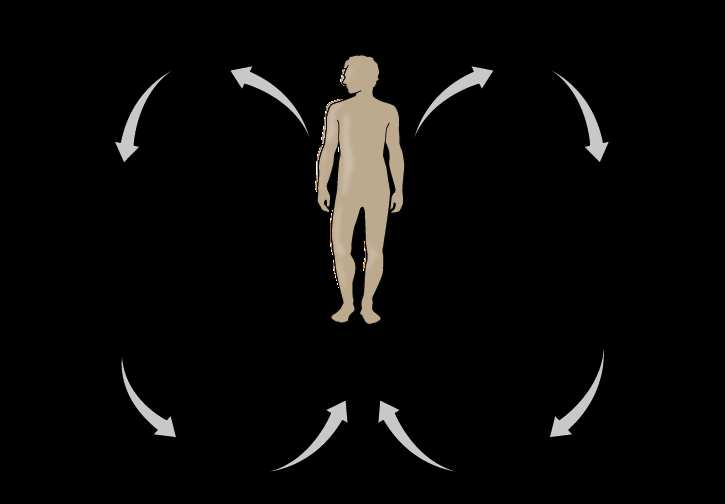
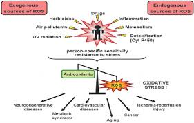
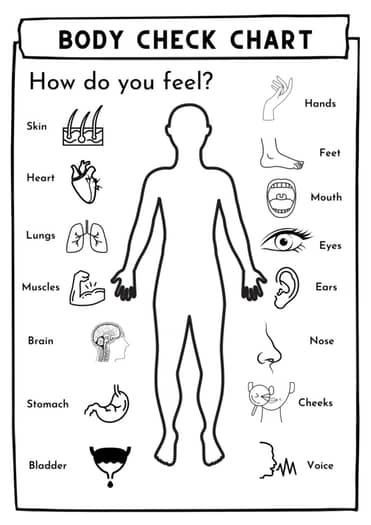
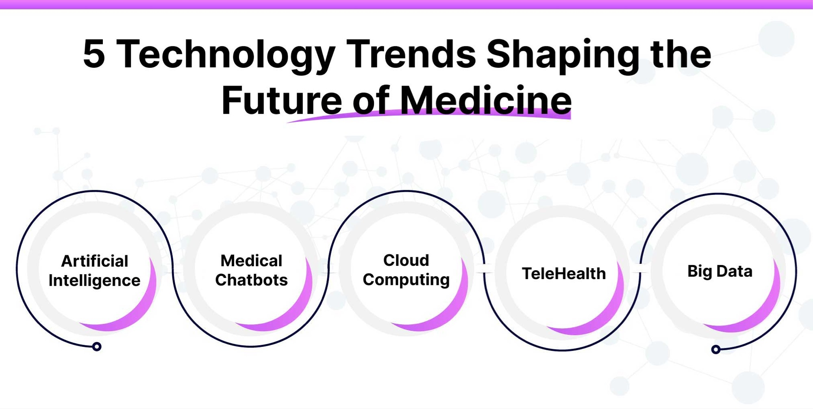
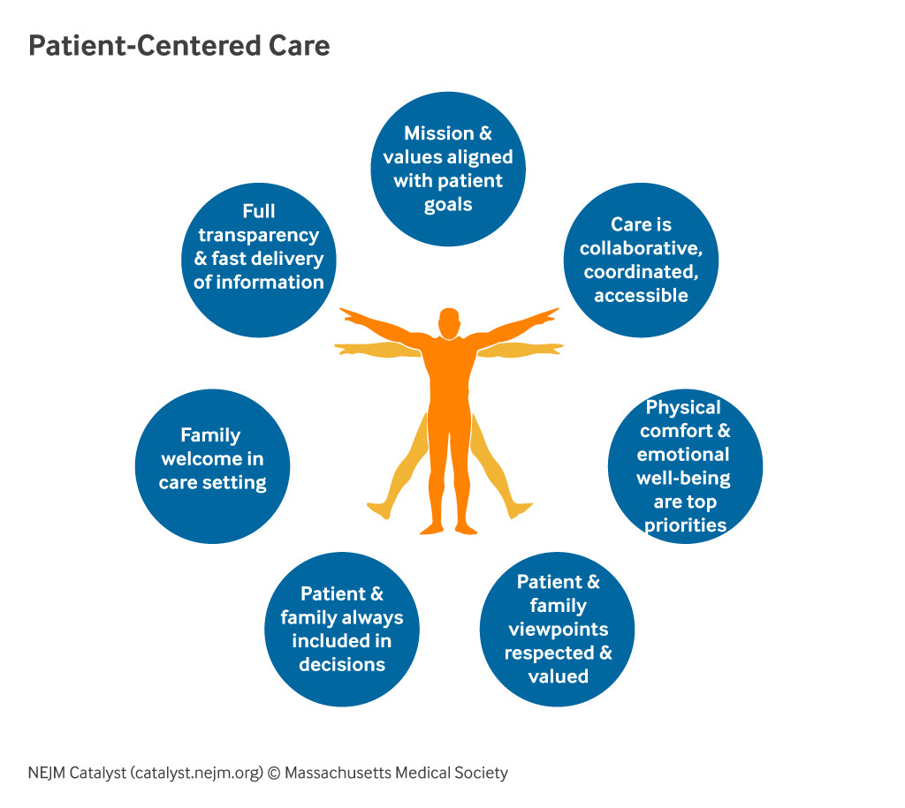

# Your Body Is the To-Do List

> **Core Thesis**: Most people organize life around external lists while ignoring the most complex system they'll ever operate—their own body. Pain is a priority signal, not a disruption. The future of healing belongs to people who can read their own systems early.

---

## Quick Reference

| Principle | Insight |
|-----------|---------|
| **Pain's role** | Priority interrupt, not inconvenience |
| **Modern problem** | Schedule becomes sacred, body becomes negotiable |
| **True discipline** | Responding sooner, not pushing harder |
| **Future of healing** | Context + collaboration, not more technology |
| **Daily question** | "What is my body asking for today?" |

---

## Pain Is a Priority Signal, Not a Disruption

*Pain pathway: nociceptors to peripheral nerves to spinal cord to brain.*
*(Source: Chapter 11 - Your Body Is the To-Do List, Page 151)*

*Homeostasis: the body continuously self-regulates toward balance.*
*(Source: Chapter 11 - Your Body Is the To-Do List, Page 151)*

In every engineered system, alarms indicate priority.

| You Would Never | Yet People Do This |
|-----------------|-------------------|
| Silence aircraft warning light to finish playlist | Take painkillers to finish workday |
| Ignore pressure gauge because late to meeting | Skip rest because deadline approaching |
| Override engine alarm because inconvenient | Push through fatigue to maintain schedule |

### What Pain, Fatigue, and Stiffness Actually Are:

| Signal | Translation |
|--------|-------------|
| Pain | "This load pattern is causing damage" |
| Fatigue | "Energy reserves depleted—rest required" |
| Stiffness | "Motion restricted—tissue needs movement" |
| Brain fog | "Processing capacity reduced—system overloaded" |
| Digestive disruption | "Resources diverted from digestion" |

> "These are not inconveniences. They are **priority interrupts** generated by the nervous system."

### When Signals Are Ignored:

| Effect | Result |
|--------|--------|
| Compensation increases | Other tissues take over |
| Efficiency drops | More energy for same output |
| Energy cost rises | Fatigue accelerates |
| Degeneration accelerates | Wear compounds |

> "The body does not get quieter when ignored. It gets louder."

---

## Why We Learned to Ignore the Body

Modern culture rewards:

| Valued | Sacrificed |
|--------|-----------|
| Output | Awareness |
| Speed | Coherence |
| Productivity | Sustainability |

### Trained Override (From Childhood):

| Training | Long-term Effect |
|----------|-----------------|
| "Sit still longer than natural" | Suppressed movement needs |
| "Suppress pain to keep performing" | Pain normalization |
| "Push through fatigue" | Exhaustion as default |
| "Normalize discomfort" | Lost body literacy |

### The Dangerous Inversion:

> "The schedule becomes sacred. The body becomes negotiable."

This inversion works—**until it doesn't**.

---

## The Body Writes the Real List

*Oxidative stress balance: exogenous/endogenous ROS vs antioxidant defense.*
*(Source: Chapter 11 - Your Body Is the To-Do List, Page 152)*

*Body check: systematic self-assessment of how different systems feel.*
*(Source: Chapter 11 - Your Body Is the To-Do List, Page 153)*

Your body constantly generates a list:

| Category | Items |
|----------|-------|
| Structural | Joints needing load redistribution |
| Tissue | Areas needing motion restored |
| Metabolic | Systems underpowered |
| Neural | Patterns no longer safe |

> "Pain is simply the font getting larger."

### The Debt Accumulates:

| Ignoring List | Result |
|---------------|--------|
| Short-term | Function maintained |
| Medium-term | Compensation patterns develop |
| Long-term | Structural breakdown |

> "Ignoring the list doesn't erase it. It defers it—with interest."

---

## Symptom Management Is List Avoidance

Treating symptoms without addressing patterns is equivalent to:
- Crossing items off someone else's list
- While your own continues to grow

### When Temporary Measures Replace Engagement:

| Intervention | Role | Risk |
|--------------|------|------|
| Medication | Pain management | Pattern continues |
| Injections | Local relief | Root cause untouched |
| Passive care | External support | No self-regulation developed |

> "Relief without reorganization is borrowed time."

---

## Reframing Discipline: Listening Is the Work

**True discipline is not pushing harder. It is responding sooner.**

### What Real Discipline Looks Like:

| Old "Discipline" | New Discipline |
|-----------------|----------------|
| Push through pain | Rest when body requests rest |
| Maintain schedule regardless | Reduce load when coordination drops |
| Wait until severe | Address stiffness before pain |
| Prioritize output | Prioritize repair over performance |

> "This is not weakness. It is systems literacy."

---

## The Future of Healing Is Not More Technology

*Future medicine: AI, chatbots, cloud, telehealth, big data.*
*(Source: Chapter 11 - Your Body Is the To-Do List, Page 156)*

The future of healing is not:
- Louder machines
- Stronger drugs
- Faster interventions

Those tools already exist—and they're excellent at what they do.

### The Missing Piece Is Context

| Current Medicine | Future Integration |
|------------------|-------------------|
| Structure OR signaling | Structure WITH signaling |
| Data OR perception | Data WITH perception |
| Intervention OR adaptation | Intervention WITH adaptation |
| Authority OR participation | Authority WITH participation |

> "The most advanced systems will not replace the human body's intelligence. They will interface with it."

---

## From Outsourcing to Collaboration

*Patient-centered care: collaboration, transparency, family inclusion, respect.*
*(Source: Chapter 11 - Your Body Is the To-Do List, Page 157)*

### The Old Model:

> "Something is wrong. Fix me."

### The Emerging Model:

> "Something has changed. Help me understand it."

### This Shift Changes Everything:

| Element | Old Role | New Role |
|---------|----------|----------|
| Patient | Recipient | Operator |
| Practitioner | Authority | Guide |
| Healing | Product | Process |

---

## Why This Model Scales

A system where the body is the to-do list:

| Benefit | Mechanism |
|---------|-----------|
| Reduces chronic dependence | Self-regulation increases |
| Lowers long-term healthcare cost | Prevention vs reaction |
| Prevents degeneration | Early response |
| Produces resilient humans | Not managed patients |

> "It does not eliminate medicine. It frees medicine to do what it does best."

---

## The Ethical Future of Healing

In the future:

| Metric | Direction |
|--------|-----------|
| Success | Measured by decreasing need for intervention |
| Best practitioners | See clients less over time |
| Healing quality | Judged by durability, not speed |
| Authority | Returns to biology, not branding |

> "This is not anti-medicine. It is post-fragmentation medicine."

---

## The Daily Question That Changes Everything

Instead of asking:

> "What do I need to get done today?"

Ask:

> **"What is my body asking for today?"**

### That Single Question:

| Effect | Mechanism |
|--------|-----------|
| Prevents escalation | Early response |
| Preserves energy | No overdraft |
| Restores trust | Body-mind alignment |
| Keeps system coherent | Integrated function |

---

## The Closing Truth

> "When your body speaks, that is the to-do list. Everything else is secondary."

The future of healing will not be owned by devices, institutions, or personalities.

It will belong to **people who can listen, respond, and adapt**.

And that future is already here—in every signal your body sends.

---

## Key Quotes

> "Pain, fatigue, stiffness, brain fog, digestive disruption—these are not inconveniences. They are priority interrupts generated by the nervous system."

> "The body does not get quieter when ignored. It gets louder."

> "The schedule becomes sacred. The body becomes negotiable."

> "Pain is simply the font getting larger."

> "Ignoring the list doesn't erase it. It defers it—with interest."

> "Relief without reorganization is borrowed time."

> "True discipline is not pushing harder. It is responding sooner."

> "The most advanced systems will not replace the human body's intelligence. They will interface with it."

> "When your body speaks, that is the to-do list. Everything else is secondary."

---

## See Also

### Related Concepts
- [Pain as Signal](pain-as-signal.md) - Pain as information, not malfunction
- [Body as System](body-as-system.md) - Complex adaptive systems view
- [Organic Mechanic Framework](organic-mechanic-framework.md) - The four-pillar integration

### Paradigms
- [Reductionism Limits](../paradigms/reductionism-limits.md) - Why fragmented care fails
- [You Are Light](../paradigms/you-are-light.md) - The electromagnetic reality

### Safety & Application
- [Frequency Safety Guardrails](../protocols/frequency-safety-guardrails.md) - When to use, when to stop
