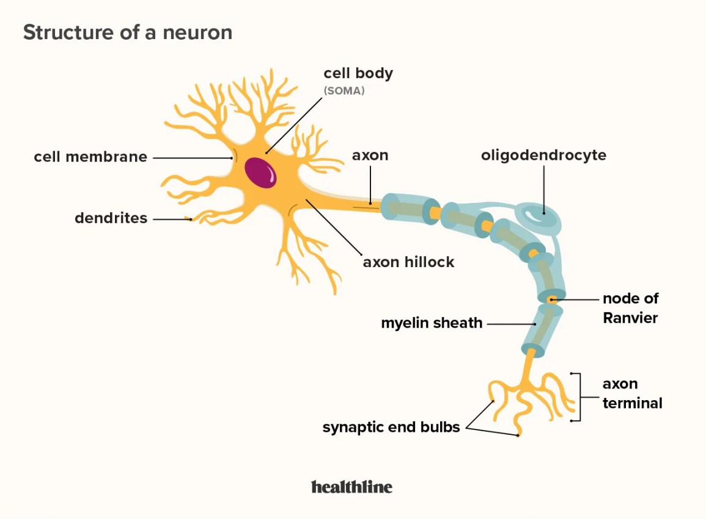
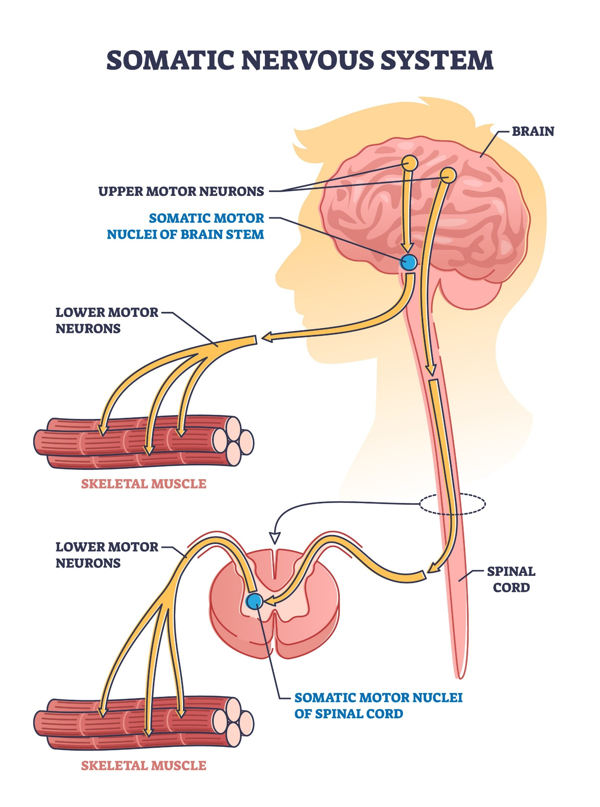
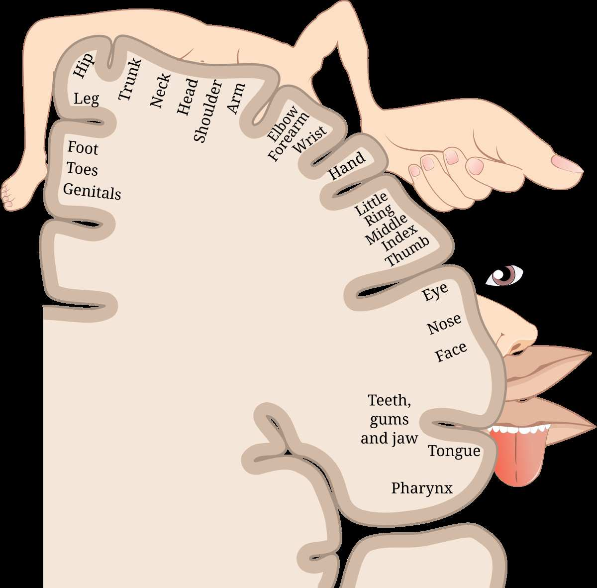
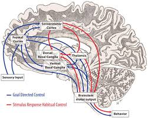

# Motor Neuron Recoding: Why Change Takes Time

> **Core Thesis**: Nothing in the nervous system changes instantly—not posture, not pain, not movement patterns. What changes instantly is awareness. What changes slowly is neuronal wiring. That distinction matters.

---

## Quick Reference

| Principle | Insight |
|-----------|---------|
| **What changes fast** | Awareness |
| **What changes slow** | Neuronal wiring |
| **Why shortcuts fail** | No structural change without time |
| **Timeline for change** | Weeks to months, not days |
| **Key mechanism** | Synaptic strengthening + myelination |

---

## What a Motor Neuron Actually Does


*Neuron anatomy: cell body (soma), dendrites receive input, axon transmits output.*
*(Source: Chapter 7 - Re-Coding Motor Neurons, Page 90)*

A motor neuron is not a switch. It is a **decision pathway**.

| Function | Description |
|----------|-------------|
| Receives inputs | Thousands of signals from other neurons |
| Integrates data | Sensory, emotional, contextual information combined |
| Threshold firing | Only fires when threshold is met |
| Output | Movement is the result, not the command |

> "Posture exists because motor neurons keep choosing the same outputs."


*Motor pathway: upper motor neurons in brain, lower motor neurons in spinal cord to skeletal muscle.*
*(Source: Chapter 7 - Re-Coding Motor Neurons, Page 91)*

---

## Why Complex Movements Collapse Into One Command


*Motor homunculus: body regions mapped to motor cortex, hands and face have disproportionate representation.*
*(Source: Chapter 7 - Re-Coding Motor Neurons, Page 93)*


*Motor learning shifts control from cortex to basal ganglia through practice.*
*(Source: Chapter 7 - Re-Coding Motor Neurons, Page 94)*

### Early Learning (New Movement)

| Characteristic | Effect |
|----------------|--------|
| Prefrontal cortex involved | High attention required |
| Energy cost high | Fatiguing |
| Conscious control | Deliberate execution |

### After Repetition (Automated Movement)

| Characteristic | Effect |
|----------------|--------|
| Subcortical control | Basal ganglia takes over |
| Procedural memory | Compressed into "program" |
| Single trigger | Many muscles respond at once |

**This is how:**
- Walking becomes effortless
- Bad posture becomes automatic
- Pain responses fire before thought

> "Your body runs shortcuts, not instructions."

---

## The Neuronal Compression Process

### Early Stage (Separate Commands)
```
Neuron A → Muscle 1
Neuron B → Muscle 2
Neuron C → Muscle 3
Neuron D → Muscle 4
```

### After Learning (Unified Command)
```
Neuron X → Muscles 1-4 (as a unit)
```

The nervous system prefers:
- Fewer signals
- Faster execution
- Lower energy cost

**This is efficiency—not intelligence.**

---

## Why "Micromanaging" the Body Fails


*Goal-directed (blue) vs stimulus-response habitual (red) pathways through basal ganglia.*
*(Source: Chapter 7 - Re-Coding Motor Neurons, Page 96)*

When someone tries to consciously control posture:

| What Happens | Result |
|--------------|--------|
| Many neurons activate simultaneously | Energy cost spikes |
| Coordination degrades | Movement quality drops |
| Nervous system flags danger | Threat perception increases |
| Fatigue sets in | Reversion to old patterns |

> "Conscious control is a temporary override, not a rewrite."

---

## Neurons Physically Change (This Is Not Metaphor)


*Synaptic potentiation: more receptors, larger spine, stronger connection.*
*(Source: Chapter 7 - Re-Coding Motor Neurons, Page 97)*

Reprogramming requires **structural change**:

| Change | What Happens |
|--------|--------------|
| Synaptic strength | Synapses strengthen or weaken |
| Dendritic spines | Grow or retract |
| Myelin thickness | Adjusts conduction speed |

**This is neuroplasticity. And it takes time.**

---

## The Re-Coding Timeline

### Phase 1: Awareness (Days 1-7)

| Experience | Neural Status |
|------------|---------------|
| Notice patterns | No structural change yet |
| Pain feels different | Perception shifting |
| Old habits feel obvious | Attention increasing |

### Phase 2: Instability (Weeks 2-4)

| Experience | Neural Status |
|------------|---------------|
| Old patterns weaken | Synapses competing |
| New patterns feel awkward | Not yet automated |
| Symptoms may fluctuate | System reorganizing |

**This is where most people quit.**

### Phase 3: Repetition & Safety (Weeks 4-8)

| Experience | Neural Status |
|------------|---------------|
| Movement succeeds repeatedly | Synapses strengthen |
| Pain decreases predictably | Myelination begins |
| Energy cost drops | Efficiency improving |

### Phase 4: Automation (Months 2-4)

| Experience | Neural Status |
|------------|---------------|
| New posture runs automatically | Motor programs migrate subcortically |
| Pain no longer needs to signal | Loop replaced |
| Conscious effort disappears | True automation |

### Phase 5: Identity Shift (Months 3-6)

| Experience | Neural Status |
|------------|---------------|
| Old patterns feel foreign | Baseline updated |
| New movement feels "like you" | Identity integration |
| Relapse risk drops dramatically | New default installed |

---

## Why Fast Relief Does Not Equal Lasting Change

Manual work, adjustments, and frequency therapies can:
- Reduce noise
- Improve input
- Lower threat perception

**But they do not replace repetition.**

They create: *A window where re-coding becomes possible.*

Without time and repetition:
- Neurons revert
- Myelin stays unchanged
- Old programs resume

> "Relief opens the door. Repetition walks through it."

---

## Case Example: Realistic Change Timeline

**Client:** 44-year-old male
**Issue:** Chronic neck + low back pain

| Timepoint | Status |
|-----------|--------|
| Week 1 | Pain reduced, posture awareness increased |
| Week 3 | Inconsistent relief, frustration |
| Week 6 | Stable improvement, less effort |
| Month 3 | Pain-free without thinking |

**Nothing magical happened. Neurons changed.**

---

## The One Rule You Cannot Break

> "If you do not allow time for neurons to re-code, you are borrowing relief against relapse."

**Healing is not about intensity. It is about duration under safety.**

---

## Why This Chapter Matters

People blame themselves for "failing" healing.

They didn't fail. They just stopped before the biology finished updating. Or they needed to function and fell back into old habits "for necessity's sake" and self-sabotaged.

Once you understand neurons and timelines:
- Patience replaces fear
- Fluctuation stops being discouraging
- Healing becomes predictable

---

## Key Quotes

> "Nothing in the nervous system changes instantly—not posture, not pain, not movement patterns."

> "What changes instantly is awareness. What changes slowly is neuronal wiring."

> "Posture exists because motor neurons keep choosing the same outputs."

> "Your body runs shortcuts, not instructions."

> "Conscious control is a temporary override, not a rewrite."

> "Relief opens the door. Repetition walks through it."

---

## See Also

### Related Concepts
- [Behavior Loops](behavior-loops.md) - Loop structure and rewriting
- [Posture as Program](posture-as-program.md) - Posture as automated software
- [Pain as Signal](pain-as-signal.md) - Pain as neural event

### Related Structures
- [Kinetic Chain](../structures/kinetic-chain.md) - Connected movement patterns
- [Joint Centration](../structures/joint-centration.md) - Optimal joint position

### Treatment Integration
- [Photobiomodulation](photobiomodulation.md) - How frequency creates the window for recoding
