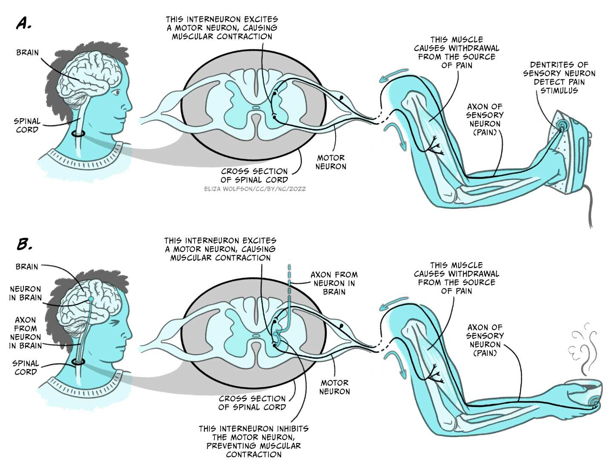
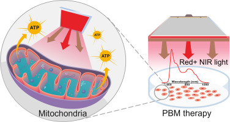
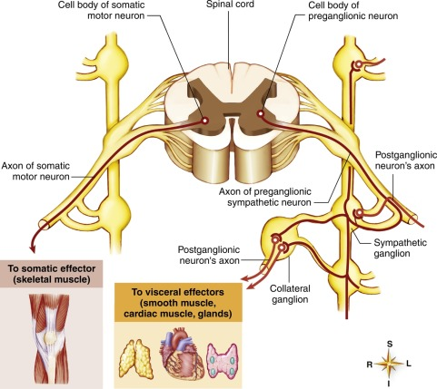
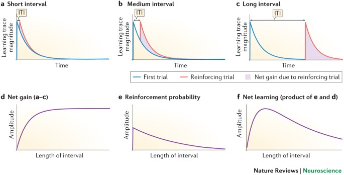
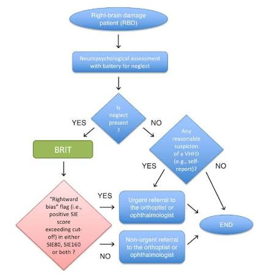

# The Organic Mechanic Framework

> **Core Thesis**: Healing fails when it becomes fragmented. The Organic Mechanic Framework is a systems-based method for restoring coherence—integrating structure, signal, energy, and behavior.

---

## Quick Reference

| Element | Definition |
|---------|------------|
| **What it is** | Systems-based method for restoring body coherence |
| **What it isn't** | A modality, philosophy, or replacement for medicine |
| **Core assumption** | Pain is a warning signal from a system that lost coherence |
| **The job** | Restore coherence so pain signal is no longer necessary |
| **Four pillars** | Structure, Signal, Energy, Behavior |
| **Success metric** | Decreasing need for intervention over time |

---

## What "Organic Mechanic" Means

*The nervous system hierarchy: Brain, Spinal cord, Nerves, Ganglia, Enteric system.*
*(Source: Chapter 10 - The Organic Mechanic Framework, Page 136)*

An organic mechanic treats the body the way an engineer treats a living system:

| Engineering Approach | Applied to Body |
|---------------------|-----------------|
| Identify force errors | Where is load accumulating? |
| Trace signal distortion | Which feedback loops are broken? |
| Restore timing and flow | Synchronize firing sequences |
| Allow system self-correction | Create conditions for healing |

### Unlike Machines, the Human Body:

| Property | Implication |
|----------|-------------|
| Heals itself | Don't force—facilitate |
| Adapts continuously | Respect adaptation timelines |
| Responds to perception and threat | Safety enables change |
| Requires safety to change | Threat blocks plasticity |

> "The framework respects this reality."

---

## The Core Assumption

> **"Pain is not a defect. It is a warning signal generated by a system that has lost coherence."**

| Old Model | Organic Mechanic Model |
|-----------|----------------------|
| Pain = something to silence | Pain = information to decode |
| Body = broken machine | Body = intelligent system under constraint |
| Goal = relief | Goal = coherence |

**The job is not to silence the signal. The job is to restore coherence so the signal is no longer necessary.**

---

## The Four Pillars

*Joint centration: optimal alignment allows balanced force distribution.*
*(Source: Chapter 10 - The Organic Mechanic Framework, Page 137)*

Every intervention must address all four pillars—directly or indirectly.

### Pillar 1: Structure (Mechanics & Force)

*Muscle structure: hierarchical organization from fiber to tendon.*
*(Source: Chapter 10 - The Organic Mechanic Framework, Page 137)*

| What It Addresses | Key Questions |
|-------------------|---------------|
| Joint centration | Which joints are off-center? |
| Load distribution | Where is force accumulating? |
| Fascial glide | Where has motion disappeared? |
| Force vectors | How is load being transferred? |

**Non-negotiable rule:** If force is mismanaged, pain will return.

### Pillar 2: Signal (Nervous System & Timing)

*Kinetic chain: joints interconnect like linked rings.*
*(Source: Chapter 10 - The Organic Mechanic Framework, Page 138)*

*Interneurons: gating motor responses, enabling both contraction and inhibition.*
*(Source: Chapter 10 - The Organic Mechanic Framework, Page 139)*

| What It Addresses | Key Questions |
|-------------------|---------------|
| Muscle firing order | Which muscles fire late? |
| Proprioceptive accuracy | Is position sense accurate? |
| Reflex dominance | Which reflexes dominate? |
| Threat perception | Where is system overprotective? |

**Non-negotiable rule:** Strength without timing reinforces dysfunction.

### Pillar 3: Energy (Frequency & Metabolism)

*PBM therapy: red/NIR light reaches mitochondria, enhances ATP.*
*(Source: Chapter 10 - The Organic Mechanic Framework, Page 143)*

*Motor output pathways: somatic to skeletal muscle, autonomic to viscera.*
*(Source: Chapter 10 - The Organic Mechanic Framework, Page 143)*

| What It Addresses | Key Questions |
|-------------------|---------------|
| Neural noise | Is the nervous system noisy? |
| Cellular energy availability | Is tissue underpowered? |
| Signal-to-noise ratio | Can clear signals get through? |
| Safety perception | Is threat threshold elevated? |

**Non-negotiable rule:** Energy opens the window—structure and signal do the work.

### Pillar 4: Behavior (Repetition & Time)

*Habit loop: cue triggers routine, reward reinforces pattern.*
*(Source: Chapter 10 - The Organic Mechanic Framework, Page 144)*

*Spacing effect: medium intervals optimize learning consolidation.*
*(Source: Chapter 10 - The Organic Mechanic Framework, Page 145)*

| What It Addresses | Key Questions |
|-------------------|---------------|
| Habit loops | What pattern repeats under stress? |
| Motor memory | What does the body default to? |
| Identity-level patterns | Has the pattern become "who I am"? |
| Relapse prevention | Has enough time passed for re-coding? |

**Non-negotiable rule:** Healing that doesn't stick wasn't finished.

---

## The Organic Mechanic Flow (Step-by-Step)

*Assessment flowchart: systematic decision-making for clinical evaluation.*
*(Source: Chapter 10 - The Organic Mechanic Framework, Page 146)*

### Step 1: Read the Body

| Action | Purpose |
|--------|---------|
| Visual posture scan | Identify gross asymmetries |
| Gait observation | See compensations in motion |
| Palpation for force and tone | Find tissue density changes |
| Identify compensation patterns | Map the workaround strategy |

### Step 2: Reduce Noise

| Action | Purpose |
|--------|---------|
| Gentle frequency or light | Lower neural noise |
| Breath and rib motion | Activate parasympathetic |
| Nervous system downshift | Reduce threat perception |

**Goal:** Create safety

### Step 3: Restore Mechanics

| Action | Purpose |
|--------|---------|
| Release fascial bunching | Restore glide |
| Re-center joints | Optimize force vectors |
| Reintroduce missing motion | Expand available range |

**Goal:** Fix force pathways

### Step 4: Reprogram Signal

| Action | Purpose |
|--------|---------|
| Cue proper sequencing | Install correct firing order |
| Reinforce timing | Strengthen right patterns |
| Reduce reflex dominance | Quiet protective reflexes |

**Goal:** Install new motor code

### Step 5: Protect With Behavior

| Action | Purpose |
|--------|---------|
| Assign minimal, precise repetition | Build without overwhelm |
| Avoid overload | Respect adaptation windows |
| Allow time for consolidation | Let neurons wire |

**Goal:** Make change automatic

---

## What This Framework Does NOT Do

| Does NOT | Does |
|----------|------|
| Chase pain points | Address system-wide coherence |
| Force alignment | Facilitate self-correction |
| Promise instant fixes | Respect biological timelines |
| Create dependency | Build independence |
| Replace medical care | Complement medicine |

> "It complements medicine by addressing what medicine cannot see or measure easily: force flow, timing, and coherence."

---

## Why This Framework Works When Others Don't

### Most Systems Fail Because They:

| Failure Mode | Organic Mechanic Alternative |
|--------------|------------------------------|
| Treat one pillar at a time | Address all four pillars |
| Ignore timelines | Respect neural adaptation windows |
| Confuse relief with resolution | Track function, not just pain |
| Rely on authority instead of adaptation | Return authority to the body |

### This Framework Succeeds Because:

| Principle | Application |
|-----------|-------------|
| Respects biology | Works within natural timelines |
| Works with nervous system | Not against it |
| Prioritizes coherence | Over correction |
| Returns authority to body | Not to practitioner |

---

## The Outcome Hierarchy

Success is measured **in order**:

| Order | Outcome | What It Means |
|-------|---------|---------------|
| 1 | Safety increases | Threat perception drops |
| 2 | Motion returns | Range expands |
| 3 | Load redistributes | Force flows correctly |
| 4 | Pain decreases | Signal no longer needed |
| 5 | Effort disappears | Movement becomes automatic |

> **Critical insight:** If pain decreases before function improves, something was skipped.

---

## The Practitioner's Role

### An Organic Mechanic Is NOT:

| Role | Why Not |
|------|---------|
| A savior | Creates dependency |
| A guru | Centralizes authority |
| A fixer | Implies body is broken |

### An Organic Mechanic IS:

| Role | Why |
|------|-----|
| A translator | Decodes body's signals |
| A systems analyst | Identifies root patterns |
| A temporary guide | Facilitates then withdraws |

> **Success metric:** How little they are needed over time.

---

## The Client's Responsibility

Healing requires participation. The body must:

| Requirement | Why |
|-------------|-----|
| Experience safety | Enables plasticity |
| Succeed repeatedly | Builds neural evidence |
| Be given time | Allows consolidation |

> "No framework bypasses biology."

---

## The Final Rule

> **"When structure, signal, energy, and behavior align, healing is not forced—it is inevitable."**

---

## Key Quotes

> "Healing fails when it becomes fragmented."

> "Pain is not a defect. It is a warning signal generated by a system that has lost coherence."

> "The job is not to silence the signal. The job is to restore coherence so the signal is no longer necessary."

> "If force is mismanaged, pain will return."

> "Strength without timing reinforces dysfunction."

> "Energy opens the window—structure and signal do the work."

> "Healing that doesn't stick wasn't finished."

> "If pain decreases before function improves, something was skipped."

> "When structure, signal, energy, and behavior align, healing is not forced—it is inevitable."

---

## See Also

### Core Concepts (The Four Pillars Expanded)
- [Pain as Signal](pain-as-signal.md) - Understanding pain as information
- [Posture as Program](posture-as-program.md) - Why posture is nervous system software
- [Behavior Loops](behavior-loops.md) - How patterns install and persist
- [Motor Neuron Recoding](motor-neuron-recoding.md) - Why change takes time
- [Photobiomodulation](photobiomodulation.md) - How frequency affects healing

### Structural Foundations
- [Body as System](body-as-system.md) - Complex adaptive systems view
- [Tensegrity](../structures/tensegrity.md) - Tension-based stability
- [Joint Centration](../structures/joint-centration.md) - Optimal joint positioning
- [Kinetic Chain](../structures/kinetic-chain.md) - Connected movement chains

### Safety & Application
- [Frequency Safety Guardrails](../protocols/frequency-safety-guardrails.md) - When to use, when to stop

### Paradigms
- [You Are Light](../paradigms/you-are-light.md) - The electromagnetic reality
- [Reductionism Limits](../paradigms/reductionism-limits.md) - Why fragmented care fails
