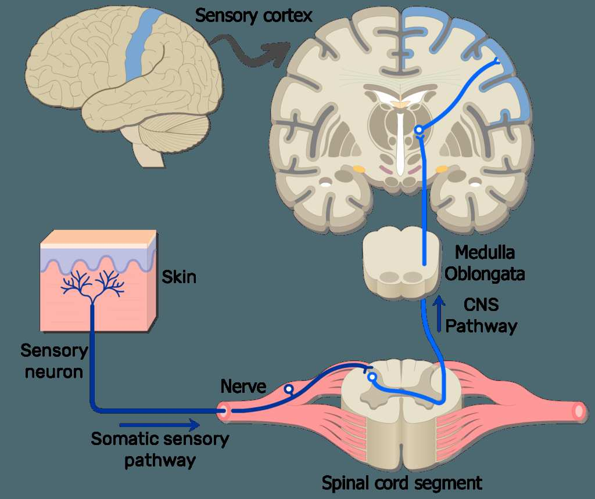
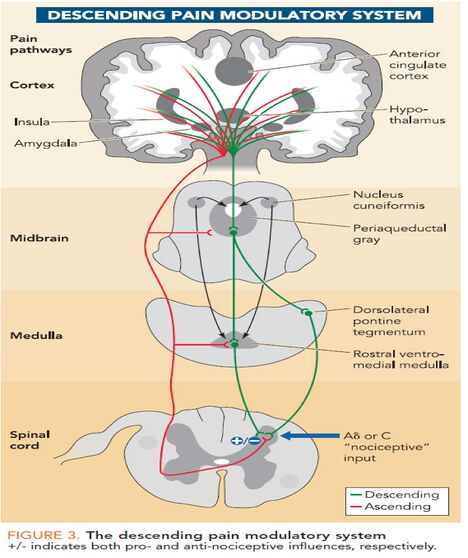
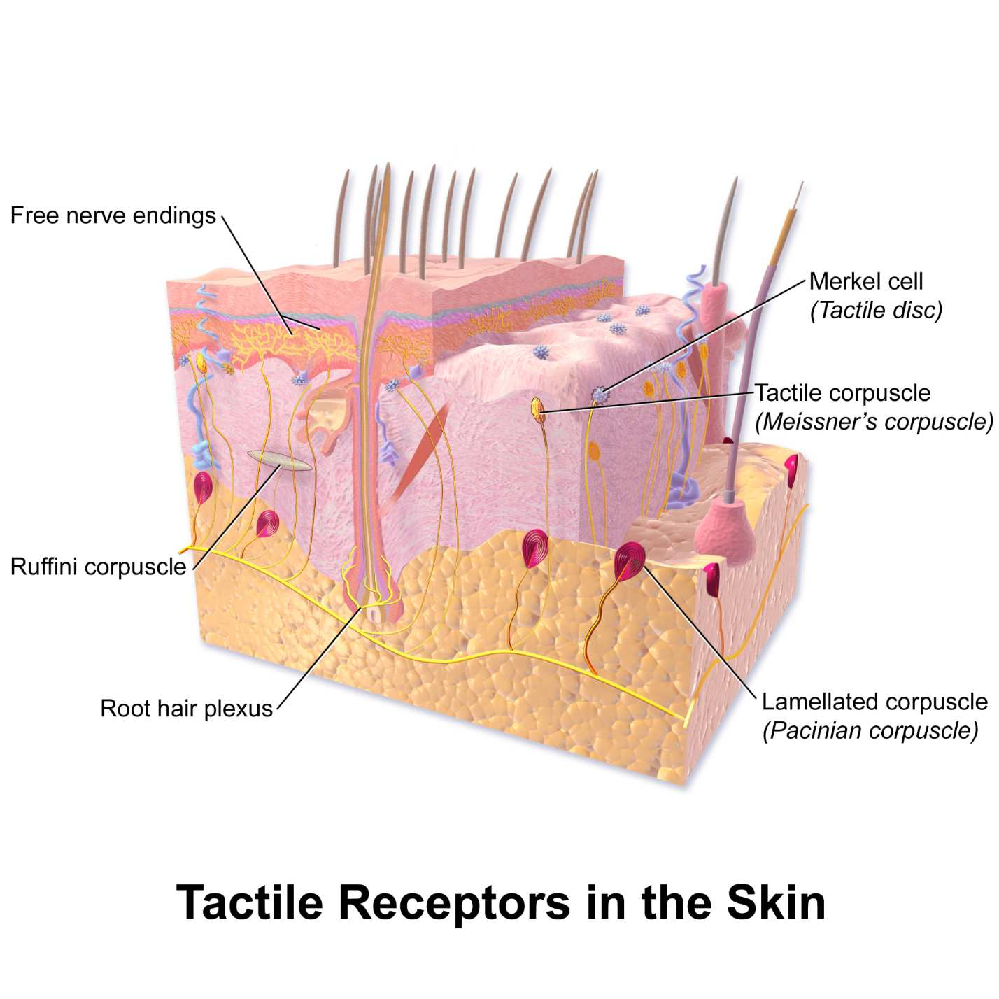
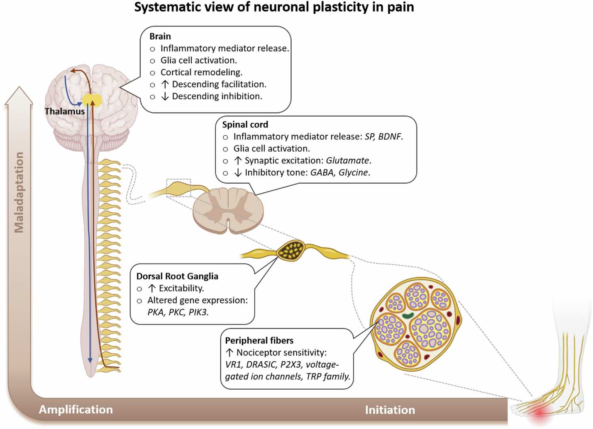

# Pain as Signal

> **Core Thesis**: Pain is not random, not a punishment, not a failure. Pain is a signal output from a complex system that has lost coherence. To resolve pain, don't silence the alarm—trace the signal upstream.

---

## Quick Reference

| Principle | Insight |
|-----------|---------|
| **Pain location** | Where force accumulates, not where it originates |
| **Pain generation** | By the nervous system, not tissues |
| **Pain = damage?** | No—pain is signal-processing outcome |
| **Chronic pain** | Signal pathway altered, even after tissue heals |
| **Resolution** | Trace upstream, restore coherence |

---

## Pain Signal Flow


*Pain signal pathway from peripheral sensory neurons through spinal cord segment to medulla oblongata and sensory cortex.*
*(Source: Chapter 4 - Pain Is an Encrypted Message, Page 38)*

```
Mechanical / Chemical / Thermal Input
              ↓
Peripheral Receptors (nociceptors, mechanoreceptors)
              ↓
Peripheral Nerve
              ↓
Spinal Cord (modulation + amplification)
              ↓
Brain (context + threat evaluation)
              ↓
         PAIN EXPERIENCE
```

**Critical Insight**: Pain is not generated at the tissue. It is interpreted by the brain.

---

## Pain Is a Nervous System Event

Pain is generated by the nervous system—not by tissues themselves.

### The Conversion Process

| Receptor Type | Detects |
|---------------|---------|
| Nociceptors | Potentially damaging stimuli |
| Mechanoreceptors | Pressure, stretch |
| Proprioceptors | Position, movement |

These convert input into **electrical signals** interpreted by spinal cord and brain **in context**.

### Context Factors

| Factor | How It Influences Pain |
|--------|------------------------|
| Past injury | Sensitization history |
| Emotional state | Amplification/suppression |
| Postural memory | Pattern recognition |
| Threat perception | Danger assessment level |
| Neural sensitization | Threshold changes |
| Autonomic tone | Fight/flight/freeze state |

---

## The Imaging Paradox

| Finding | Pain Level | Explanation |
|---------|------------|-------------|
| Severe imaging findings | No pain | Tissue state ≠ pain signal |
| Normal imaging | Severe pain | Signal-processing outcome |

> "Pain is not simply a measure of damage. It is a signal-processing outcome."

---

## Acute vs. Chronic Pain

### Acute Pain (Protective)

| Characteristic | Function |
|----------------|----------|
| Short-term | Warn of immediate threat |
| Proportional to damage | Signal tissue injury |
| Resolves with healing | Tissue repair → signal stops |
| Adaptive | Prevents further damage |

### Chronic Pain (Altered Signaling)

| Characteristic | Mechanism |
|----------------|-----------|
| Persists beyond healing | Signal pathway altered |
| Disproportionate | Amplification at spinal/brain level |
| Self-perpetuating | Neural patterns lock in |
| Not psychosomatic | Neurophysiological |

> "Chronic pain often persists even after tissues have healed because the signal pathway remains altered. This is not psychosomatic. It is neurophysiological."

---

## Central Sensitization


*The descending pain modulatory system shows how the brain can amplify or inhibit pain signals through pathways from cortex through midbrain and medulla to spinal cord.*
*(Source: Chapter 4 - Pain Is an Encrypted Message, Page 41)*

When the nervous system becomes "wound up":

| Stage | What Happens |
|-------|--------------|
| Initial injury | Normal pain response |
| Repeated signaling | Spinal cord amplifies |
| Threshold drops | Less input → more pain |
| Spread | Pain expands beyond original site |
| Persistence | Continues without input |

### Signs of Sensitization

- Pain out of proportion to findings
- Pain that spreads
- Allodynia (pain from non-painful stimuli)
- Hyperalgesia (excessive pain from mild stimuli)
- Pain that persists despite treatment

---

## Where Pain Shows Up vs. Where It Originates

| Pain Location | Common Origin |
|---------------|---------------|
| Knee | Foot mechanics, hip dysfunction |
| Shoulder | Rib restriction, thoracic spine |
| Neck | Ankle instability, pelvic rotation |
| Low back | Hip centration loss, diaphragm |
| Headache | Jaw, cervical spine, eyes |

> "Pain appears where force accumulates, not where it originates."

---

## The Pain Decision Tree

### Node 1: Is There Acute Tissue Damage?
- **YES** → Protective pain (short-term, adaptive) → Allow healing
- **NO** → Proceed upstream

### Node 2: Is Force Being Mismanaged?
- **YES** → Nociceptors fire repeatedly → Address mechanics
- **NO** → Proceed upstream

### Node 3: Has the Nervous System Sensitized?
- **YES** → Pain persists without damage → Address neural programming
- **NO** → Resolve mechanically

---

## Pain as Information

### What Pain Tells You

| Pain Pattern | Possible Message |
|--------------|------------------|
| Sharp with movement | Mechanical irritation |
| Dull and constant | Congestion, inflammation |
| Burning/electric | Neural involvement |
| Moves around | Compensation shifting |
| Worse with stress | Autonomic component |
| Better with rest | Loading issue |

### Questions to Decode Pain

| Ask | Reveals |
|-----|---------|
| When did it start? | Trigger event |
| What makes it worse? | Mechanical drivers |
| What makes it better? | System needs |
| Where does it refer? | Neural pathway |
| What else changed? | System involvement |

---

## Resolving Pain: The Upstream Approach

### Instead of Silencing the Alarm

| Don't | Do |
|-------|-----|
| Mask with medication | Trace to source |
| Stretch the painful area | Address driver |
| Strengthen where it hurts | Restore timing |
| Focus on symptom | Restore system coherence |

### Resolution Sequence

1. **Map** the pain pattern
2. **Trace** upstream to force mismanagement
3. **Identify** system involvement
4. **Address** drivers (not symptoms)
5. **Restore** coherence across systems
6. **Reprogram** neural patterns

---

## Mechanotransduction: Force to Signal


*Tactile receptors in skin layers: Free nerve endings, Merkel cells, Meissner's corpuscles, Ruffini corpuscles, and Pacinian corpuscles.*
*(Source: Chapter 4 - Pain Is an Encrypted Message, Page 43)*

Tissues convert force into electrical signals through **mechanotransduction**.

### Mechanical Inputs That Trigger Signals

| Input Type | Effect |
|------------|--------|
| Shear | Sliding force between tissue layers |
| Compression | Pressure loading |
| Torsion | Twisting force |
| Sustained tension | Prolonged stretch |

### Sensors Involved

| Receptor | Detects |
|----------|---------|
| Ruffini corpuscles | Slow stretch |
| Pacinian corpuscles | Rapid change |
| Nociceptors | Threat/damage |

**If force exceeds tolerance:**
```
Force overload → receptor firing → neural alarm
```

> "Pain is the nervous system saying: 'This load is unsafe given current coordination.'"

---

## The Fascial Shortcut: Why Pain Spreads


*Referred pain patterns from trigger points - pain location often distant from muscle of origin.*
*(Source: Chapter 4 - Pain Is an Encrypted Message, Page 45)*

Fascia creates **low-resistance highways** for force and signal transmission.

### Two Important Distinctions

| Map Type | What It Traces |
|----------|----------------|
| Dermatomes | Nerve root maps |
| Fascial lines | Force maps |

Pain often follows **fascial logic**, not nerve logic.

### Why Pain Appears Elsewhere

| Actual Issue | Felt As |
|--------------|---------|
| Hip dysfunction | Knee pain |
| Rib restriction | Shoulder pain |
| Jaw tension | Pelvic instability |

---

## The Pain Encryption Model

Pain behaves like an **encrypted output** - multiple layers obscure the original signal.

### Encryption Layers

| Layer | What Happens |
|-------|--------------|
| 1. Mechanical distortion | Force error occurs |
| 2. Fascial adaptation | Load reroutes through tissue |
| 3. Neural modulation | Threat bias applied |
| 4. Brain interpretation | Memory + fear added |

By the time pain is felt, the original signal is **obscured**.

> "Treating pain at layer 4 ignores layers 1-3."

---

## Why Pain Persists After "Healing"


*Systematic view of neuronal plasticity: changes occur at peripheral fibers, dorsal root ganglia, spinal cord, and brain levels.*
*(Source: Chapter 4 - Pain Is an Encrypted Message, Page 50)*

If pain persists after tissue repair, the issue is **signal memory**.

### Loop Lock-In Sequence

```
Old injury → altered movement
    → repeated nociception
    → spinal cord amplification
    → cortical expectation
    → pain without damage
```

The body is no longer injured. It is **expecting danger**.

---

## Decoding Pain: Practical Questions

Instead of asking "Where does it hurt?", ask:

| Question | What It Reveals |
|----------|-----------------|
| Where is force excessive? | Mechanical overload |
| Where is motion absent? | Compensation pattern |
| Where is timing delayed? | Motor control issue |
| Where is tension continuous? | Protective guarding |

### Pain Resolves When:

- Load is redistributed
- Motion is restored
- Timing is corrected
- Threat perception drops

---

## Case Example: Low Back Pain

**Reported pain:** Low back

**Actual sequence:**
```
Ankle instability
    → altered gait timing
    → pelvic rotation
    → lumbar overactivation
    → spinal nociception
    → pain
```

**Treating the back alone = chasing the output.**

---

## The One Rule That Always Holds

> "Pain is never the first failure. It is the last warning."

---

## Why This Chapter Changes Everything

Once pain is seen as a **signal trace**, you stop asking:
- "What's wrong with me?"

And start asking:
- "What pattern is my body protecting?"
- "How crucial is this pattern to me?"
- "Can I survive without it while I learn a new way?"

---

## Key Quotes

> "Pain is not random. It is not a punishment. It is not a failure. Pain is a signal output from a complex system that has lost coherence."

> "If you want to resolve pain, you don't silence the alarm. You trace the signal upstream."

> "Chronic pain = signal persistence, not tissue failure."

> "Pain is the nervous system saying: 'This load is unsafe given current coordination.'"

---

## See Also

### Nervous System Concepts
- [Posture as Program](posture-as-program.md) - Posture as nervous system software
- [Behavior Loops](behavior-loops.md) - How patterns lock in and persist
- [Body as System](body-as-system.md) - Understanding multi-system involvement

### Related Structures & Reference
- [Pain Decision Tree](../reference/pain-decision-tree.md) - Visual flowchart for pain assessment
- [Kinetic Chain](../structures/kinetic-chain.md) - How pain travels through connected structures
- [Fascial Bunching](../structures/fascial-bunching.md) - Force transmission through fascia
- [Reductionism Limits](../paradigms/reductionism-limits.md) - Why symptom-chasing fails
