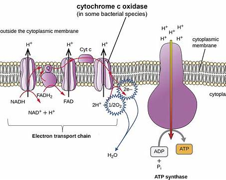
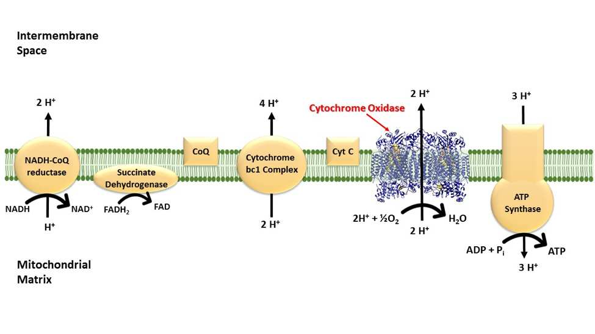
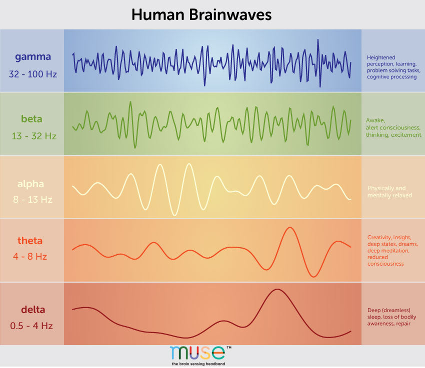
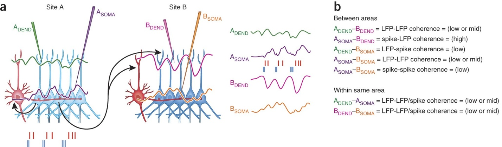

# Photobiomodulation: How Light Reorganizes the Nervous System

> **Core Thesis**: Light does not "heal" the body. Light changes signaling conditions—and the body heals itself when signaling becomes coherent.

---

## Quick Reference

| Principle | Insight |
|-----------|---------|
| **Primary target** | Cytochrome c oxidase (CCO) |
| **Key wavelengths** | Red (630-660nm), Near-infrared (810-850nm) |
| **Mechanism** | ATP production, ROS normalization |
| **Critical law** | Arndt-Schulz: more is not better |
| **Role in healing** | Creates window for neuroplasticity |

---

## The Arndt-Schulz Law (Why More Is Not Better)

*Arndt-Schulz Law: too little has no effect, optimal dose stimulates, too much inhibits.*
*(Source: Chapter 8 - Frequency Breakdown, Page 101)*

The Arndt-Schulz Law describes a **biphasic dose-response relationship**:

| Dose Level | Response |
|------------|----------|
| Too little stimulus | No effect |
| Optimal stimulus | Positive biological response |
| Too much stimulus | Inhibition or damage |

This principle applies to:
- Exercise
- Stress
- Hormones
- Medications
- **Light and frequency**

> "Photobiomodulation is hormetic. It works only within a specific therapeutic window."

**This is why:**
- Low-level laser can stimulate healing
- High-level laser can inhibit or damage tissue
- Frequency precision matters more than power

---

## The Cellular Target: Cytochrome c Oxidase

*Cytochrome c oxidase: Complex IV of electron transport chain, primary target of photobiomodulation.*
*(Source: Chapter 8 - Frequency Breakdown, Page 103)*

*Electron transport chain: NADH → Complex I-IV → ATP synthase → ATP.*
*(Source: Chapter 8 - Frequency Breakdown, Page 104)*

At the cellular level, photobiomodulation targets **cytochrome c oxidase (CCO)**—Complex IV of the mitochondrial electron transport chain.

### Why CCO Matters

| Function | Effect |
|----------|--------|
| Transfers electrons to oxygen | Final step in respiration |
| Enables ATP production | Cellular energy |
| Regulates cellular respiration | Metabolic control |
| Controls oxidative stress balance | ROS management |

### When Light Reaches Tissue

| Process | Result |
|---------|--------|
| Photons absorbed by CCO | Enzyme activated |
| Electron transfer efficiency increases | Better respiration |
| ATP production rises | More cellular energy |
| Reactive oxygen species normalize | Not eliminate—balance |
| Cellular signaling improves | Better communication |

> "This is not 'energy healing.' This is mitochondrial optimization."

---

## Frequency vs Power (Hz vs Watts)

Many people confuse:
- **Power** (how strong)
- **Frequency** (how often)

They are not the same.

### Power (Watts)

| Function | Effect |
|----------|--------|
| Determines penetration | How deep light reaches |
| Determines intensity | How much energy delivered |
| Too high | Inhibitory (per Arndt-Schulz) |

### Frequency (Hz)

| Function | Effect |
|----------|--------|
| Determines biological resonance | Which systems respond |
| Influences neural firing patterns | Entrainment |
| Affects tissue-specific responses | Targeted effects |

> "Frequency is the language. Power is the volume knob."

---

## Why Different Hz Produce Different Effects

*Brainwave frequency bands and their associated mental states.*
*(Source: Chapter 8 - Frequency Breakdown, Page 107)*

Biological systems already operate in frequency bands:
- Peripheral nerves fire rhythmically
- Muscles contract in oscillatory patterns
- Brain regions synchronize via frequencies

### External Frequency Input Can:

| Effect | Mechanism |
|--------|-----------|
| Entrain neural firing | Match biological rhythms |
| Reduce noise | Improve signal-to-noise ratio |
| Improve coherence | Better coordination |

**This is not mystical. It is coupled oscillation physics.**

---

## Practical Hz Ranges (Clinical Framework)

*These ranges are functional categories, not rigid prescriptions.*

### Low Frequencies: 1-10 Hz

| Primary Effects | Clinical Use |
|-----------------|--------------|
| Nervous system inhibition | Acute pain |
| Pain reduction | Neural hyperexcitability |
| Parasympathetic dominance | Post-injury calming |

**Think: "Turning down the alarm"**

### Mid Frequencies: 10-100 Hz

| Primary Effects | Clinical Use |
|-----------------|--------------|
| Neuromuscular coordination | Postural retraining |
| Motor neuron recruitment | Gait correction |
| Proprioceptive clarity | Muscle re-education |

**Think: "Cleaning up signal timing"**

### High Frequencies: 100-1,000+ Hz

| Primary Effects | Clinical Use |
|-----------------|--------------|
| Tissue metabolism | Chronic degeneration |
| Cellular repair | Poor healing environments |
| ATP production | Low-energy tissue states |

**Think: "Improving cellular throughput"**

---

## Why Frequency Accelerates—But Doesn't Replace—Re-Coding

*Neural coherence: how frequency synchronizes communication between brain regions.*
*(Source: Chapter 8 - Frequency Breakdown, Page 110)*

Frequency does three critical things:
1. **Lowers neural noise**
2. **Improves signal clarity**
3. **Reduces threat perception**

This creates the **biological conditions required for neuroplasticity**.

### But Frequency Does Not:
- Create repetition
- Install habits
- Replace movement

> "Frequency opens the window. Behavior rewrites the code."

---

## Frequency + Neurons + Time (Integrated Timeline)

### Week 1-2

| Experience | Neural Status |
|------------|---------------|
| Pain reduction | Neural noise decreases |
| Improved movement tolerance | Threat perception lowering |
| Increased safety perception | System calming |

### Weeks 3-6

| Experience | Neural Status |
|------------|---------------|
| Better motor learning | Synaptic reinforcement improves |
| Faster pattern acquisition | Plasticity enhanced |
| Reduced flare-ups | Stability increasing |

### Months 2-4

| Experience | Neural Status |
|------------|---------------|
| New posture stabilizes | Neural efficiency increases |
| Old pain loops fade | Old patterns weakening |
| Less frequency needed | System self-regulating |

---

## Why Overuse Backfires (Arndt-Schulz Revisited)

Too much frequency or power:

| Effect | Result |
|--------|--------|
| Desensitizes receptors | Reduced response |
| Inhibits mitochondrial response | Less ATP production |
| Increases fatigue | System overwhelm |
| Slows adaptation | Delayed progress |

**This is why:**
- Daily maximal laser slows progress
- Random frequencies reduce coherence
- "More sessions" isn't always better

> "The nervous system adapts to stimuli. Respect the curve."

---

## The One Rule of Frequency-Based Healing

> "Use frequency to create safety, not dependency."

**If healing requires constant stimulation, the system hasn't learned yet.**

---

## Why This Chapter Matters

This chapter grounds your work in:
- **Physics** (frequency & resonance)
- **Biology** (mitochondria & CCO)
- **Neuroscience** (signal coherence)
- **Time** (plasticity timelines)

It explains **why your methods work**, without exaggeration or mysticism.

---

## Key Quotes

> "Light does not 'heal' the body. Light changes signaling conditions—and the body heals itself when signaling becomes coherent."

> "Photobiomodulation is hormetic. It works only within a specific therapeutic window."

> "This is not 'energy healing.' This is mitochondrial optimization."

> "Frequency is the language. Power is the volume knob."

> "Frequency opens the window. Behavior rewrites the code."

> "Use frequency to create safety, not dependency."

---

## See Also

### Related Concepts
- [Motor Neuron Recoding](motor-neuron-recoding.md) - Why change takes time
- [Behavior Loops](behavior-loops.md) - Loop structure and rewriting
- [Pain as Signal](pain-as-signal.md) - Pain as neural event

### Safety & Protocols
- [Frequency Safety Guardrails](../protocols/frequency-safety-guardrails.md) - When to use, when to stop

### Paradigms
- [You Are Light](../paradigms/you-are-light.md) - Electromagnetic nature of biology
