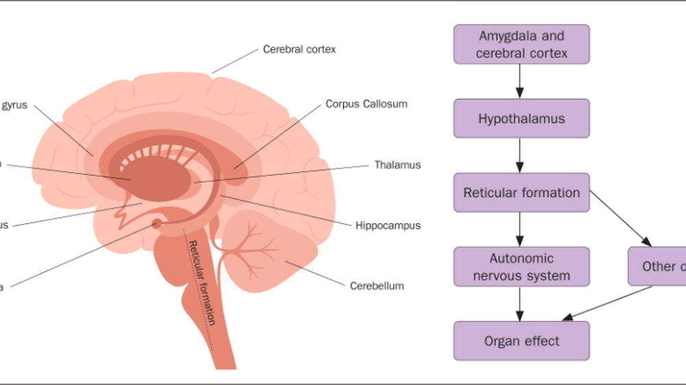
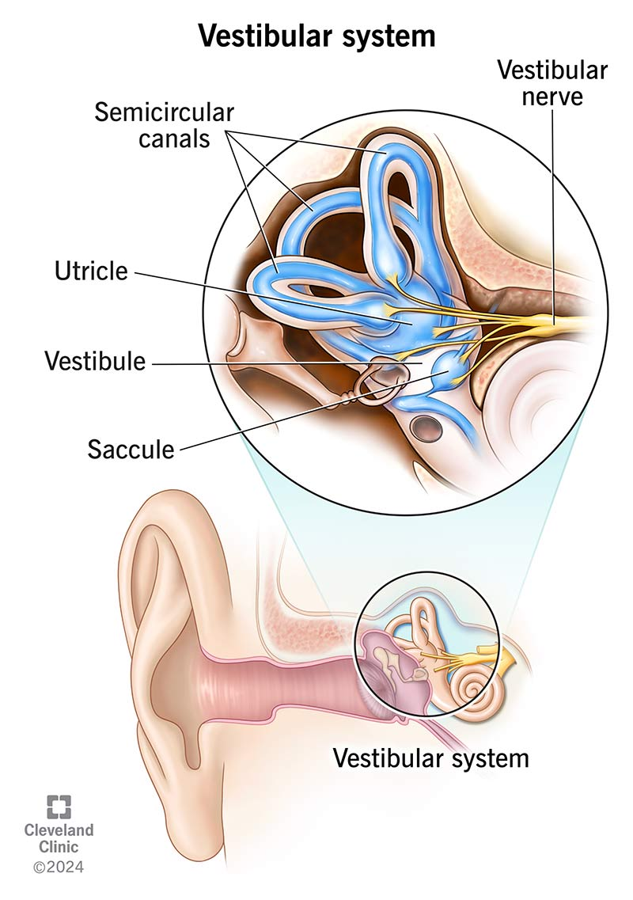
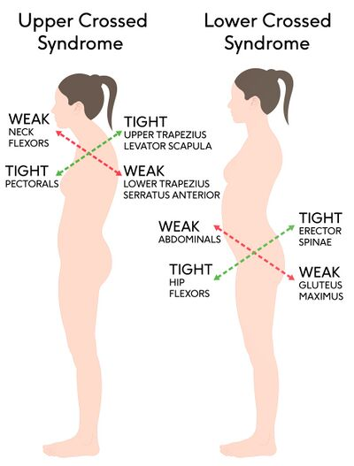
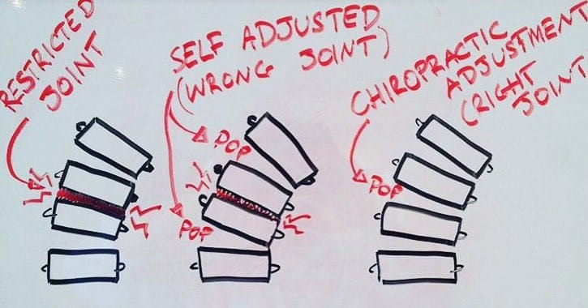
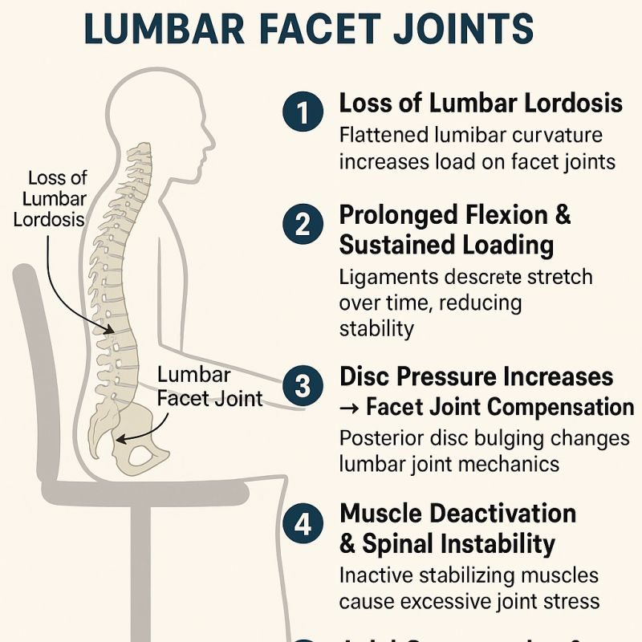

# Posture as Program

> **Core Thesis**: Posture is not a position. It is not a correction. It is not something you "try" to maintain. Posture is a program. And like any program, it runs automatically—until rewritten.

---

## Quick Reference

| Principle | Insight |
|-----------|---------|
| **Posture nature** | Software program, not position |
| **Control level** | Runs below conscious awareness |
| **Change method** | Rewrite code, don't force position |
| **Why corrections fail** | Conscious override is weakest layer |
| **What drives posture** | Sensory input → brain prediction → motor output |

---

## The Posture Stack (Software Architecture)

Think of posture as **layered software**:

| Level | Layer | Description |
|-------|-------|-------------|
| 1 | Conscious Control | Voluntary (weakest) |
| 2 | Motor Programs | Habitual patterns |
| 3 | Reflexes | Protective responses |
| 4 | Sensory Input | Proprioception, vision, vestibular |

Most people attempt to fix posture at **Level 1**. That is the weakest layer.

> "You cannot consciously override reflexive code for long."

---

## The Posture Control Loop (Feedback System)


*Reticular formation connects cerebral cortex through hypothalamus to autonomic nervous system and organ effects.*
*(Source: Chapter 5 - Posture Is a Nervous System Program, Page 55)*

Posture runs as a **closed-loop system**:

```
Sensory Input
     ↓
Brain Prediction
     ↓
Motor Output
     ↓
Mechanical Load
     ↓
Updated Sensory Input
     ↓
(loop continues)
```

**Critical Insight**: If the input is distorted, the output will be distorted—even if you "know better."

---

## Sensory Inputs That Define Posture


*Proprioceptive feedback: muscle spindles detect stretch, Golgi tendon organs detect tension, both communicate through spinal cord.*
*(Source: Chapter 5 - Posture Is a Nervous System Program, Page 57)*

Posture depends on **three primary sensor groups**:

### 1. Proprioception (Joint & Muscle Sensors)

| Function | Effect on Posture |
|----------|-------------------|
| Tells brain where you are | Position awareness |
| Heavily influenced by fascia | Tissue state affects signal |
| Joint centration dependent | Decentration = bad data |

### 2. Vestibular System (Inner Ear)


*Vestibular system: semicircular canals, utricle, saccule, and vestibular nerve detect head position and acceleration.*
*(Source: Chapter 5 - Posture Is a Nervous System Program, Page 58)*

| Function | Effect on Posture |
|----------|-------------------|
| Detects head position | Orients body in space |
| Detects acceleration | Balance responses |
| Overrides everything when threatened | Safety takes priority |

### 3. Vision

| Function | Effect on Posture |
|----------|-------------------|
| Strongest postural influence | Eyes lead, body follows |
| Forward head posture often starts here | Screen use → head forward |
| Horizon reference | Tilted vision = tilted posture |

> "If any sensor is unreliable, posture adapts around it."

---

## Why "Stand Up Straight" Fails (Code Conflict)


*Predictable patterns: tight upper traps/levator scapula with weak deep neck flexors (upper); tight hip flexors with weak glutes (lower).*
*(Source: Chapter 5 - Posture Is a Nervous System Program, Page 59)*

When someone tries to "stand straight":

| Step | What Happens |
|------|--------------|
| 1 | Conscious muscles activate |
| 2 | Reflex muscles resist |
| 3 | Fascia pulls them back |
| 4 | Fatigue sets in |
| 5 | Old posture returns |

This is a **priority conflict**.

### The Nervous System Trusts:

| Priority | What It Means |
|----------|---------------|
| 1. Safety | Protect from perceived threat |
| 2. Efficiency | Minimize energy cost |
| 3. Familiarity | Use known patterns |

**Your opinion comes last.**

---

## Posture as Stored Memory (The Hard Drive)


*Motor memory storage: prefrontal cortex (planning), basal ganglia (habit), cerebellum (coordination), hippocampus (context), amygdala (emotion).*
*(Source: Chapter 5 - Posture Is a Nervous System Program, Page 62)*

Posture is stored as **motor memory**.

### Each Repetition Reinforces:

- Muscle firing order
- Fascial tension patterns
- Joint loading patterns

### After Enough Repetitions:

| What Happens | Result |
|--------------|--------|
| Pattern becomes "normal" | Feels right even if wrong |
| Deviating feels wrong | Correction feels unsafe |
| Correction feels threatening | Body resists change |

> "Bad posture feels right because it is familiar."

---

## Case Diagram: Why Adjustments Don't Hold


*Restricted joint vs. self-adjusted (wrong joint) vs. chiropractic adjustment (right joint) - position changes but program doesn't.*
*(Source: Chapter 5 - Posture Is a Nervous System Program, Page 65)*

**Sequence:**

```
Manual correction → temporary alignment
    → unchanged motor program
    → same muscle firing
    → same fascial pull
    → joint returns to old position
```

This is not failure. It is **expected behavior**.

---

## The Cost of Running Bad Code


*Cascade: loss of lumbar lordosis → prolonged flexion → disc pressure increases → facet joint compensation → muscle deactivation → spinal instability.*
*(Source: Chapter 5 - Posture Is a Nervous System Program, Page 67)*

Running faulty posture code leads to:

| Consequence | Mechanism |
|-------------|-----------|
| Chronic muscle tone | Constant low-level activation |
| Reduced circulation | Compression restricts blood flow |
| Joint compression | Uneven loading |
| Neural irritation | Nerve compression/tension |
| Increased energy cost | Inefficient patterns waste energy |

**The body survives—but pays interest.**

---

## How Posture Code Is Actually Rewritten

Posture changes **only** when the nervous system updates its prediction model.

### This Happens When:

| Condition | What Changes |
|-----------|--------------|
| Sensory input improves | Better data in |
| Force distribution normalizes | Joints centered |
| Threat perception drops | Safety established |
| New movement succeeds repeatedly | Pattern validated |

### Rewriting Code Requires:

```
Input change → repetition → safety → automation
```

---

## Case Study: Reprogramming Posture

**Client:** 41-year-old male
**Complaint:** Chronic neck and low back pain
**History:** Desk work, multiple therapies tried

### Intervention:

| Step | Action |
|------|--------|
| 1 | Restored rib motion |
| 2 | Improved hip centration |
| 3 | Retrained gait timing |
| 4 | Reduced cervical overactivation |

### Result:

Posture corrected **without conscious effort**.

> "The body updated its code."

---

## The One Rule of Posture Programming

> "You cannot 'hold' good posture. You can only install it."

---

## Why This Chapter Matters

| If posture were... | This would fix it... |
|--------------------|----------------------|
| A position | Mirrors |
| Strength | Gyms |
| Knowledge | Instructions |

**Posture is software.**

And software changes only when the system **trusts the update**.

---

## Key Quotes

> "Posture is not a position. It is not a correction. It is not something you 'try' to maintain. Posture is a program."

> "You cannot consciously override reflexive code for long."

> "Bad posture feels right because it is familiar."

> "You cannot 'hold' good posture. You can only install it."

---

## See Also

### Nervous System Concepts
- [Pain as Signal](pain-as-signal.md) - Pain as neural event, not tissue damage
- [Behavior Loops](behavior-loops.md) - How patterns lock in and resist change
- [Body as System](body-as-system.md) - Multi-system integration

### Related Structures
- [Joint Centration](../structures/joint-centration.md) - Optimal joint positioning affects sensory input
- [Kinetic Chain](../structures/kinetic-chain.md) - Connected movement patterns
- [Fascial Bunching](../structures/fascial-bunching.md) - How fascia stores patterns
