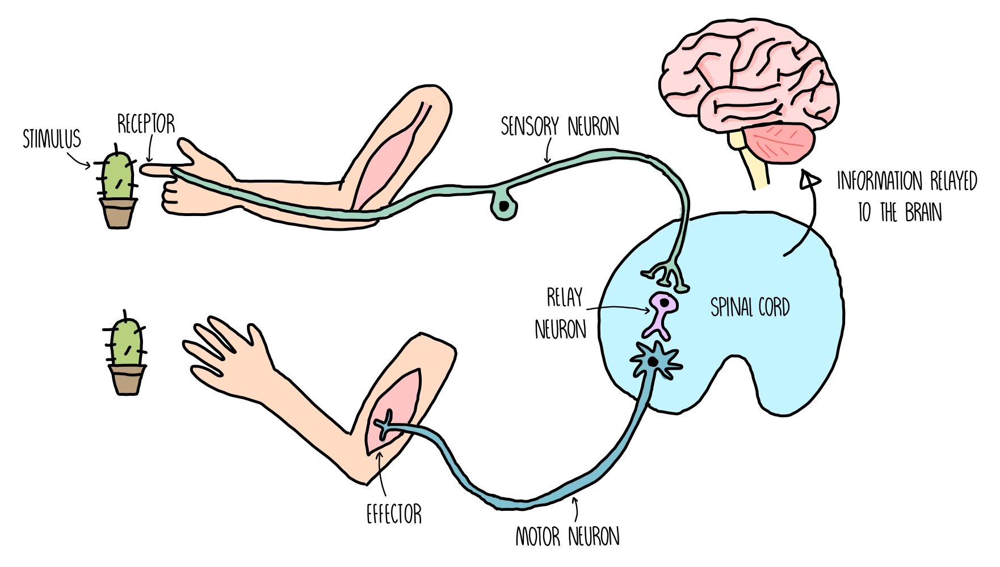
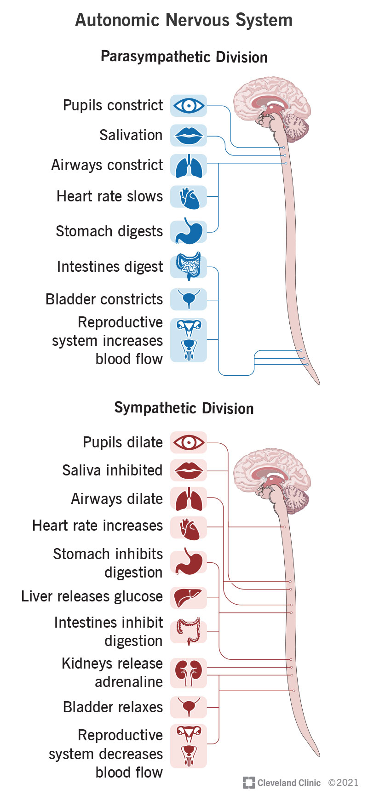
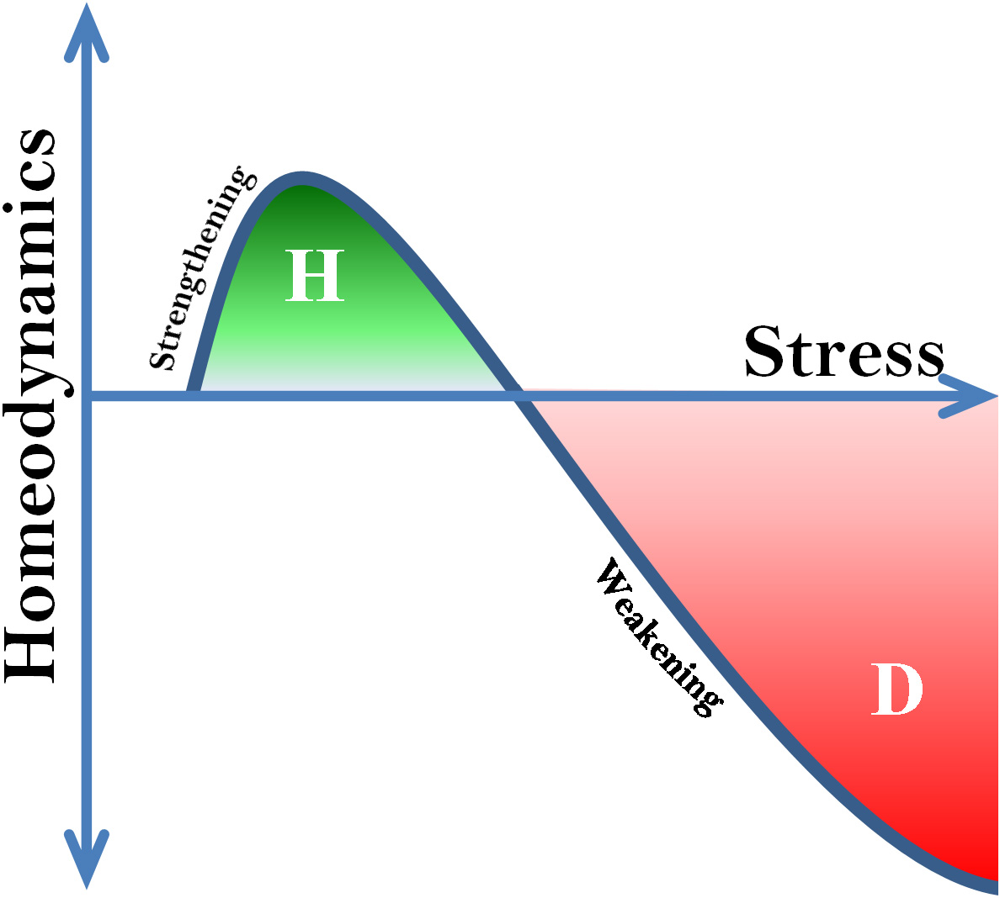
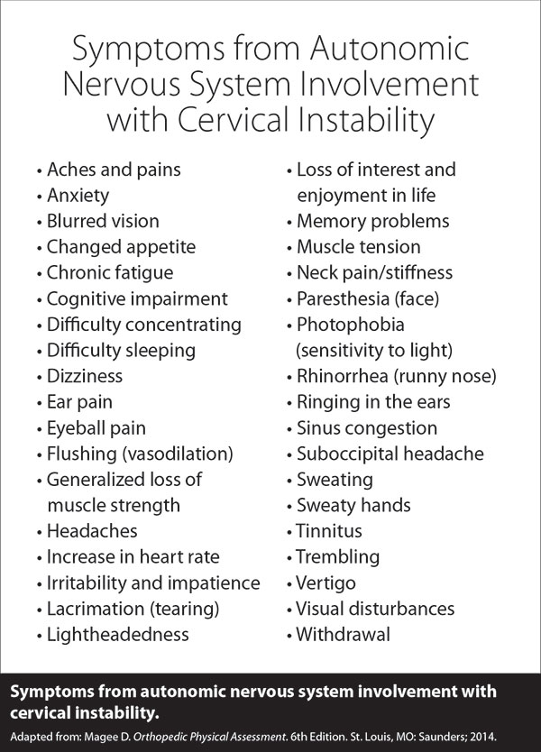

# Frequency Safety Guardrails

> **Core Thesis**: Any tool powerful enough to help is powerful enough to harm. Light, frequency, and neural modulation are no exception. This protocol defines the boundaries that keep healing adaptive rather than disruptive.

---

## Quick Reference

| Principle | Guideline |
|-----------|-----------|
| **Prime directive** | Do no signal harm |
| **Dosing rule** | Minimum effective signal |
| **Warning signs** | Fatigue, headache, irritability, sleep disruption |
| **Frequency role** | Create safety, not dependency |
| **Structure requirement** | Frequency cannot replace structural work |

---

## The Prime Directive: Do No Signal Harm

*Signal pathway: stimulus to receptor to sensory neuron to spinal cord to motor neuron to effector.*
*(Source: Chapter 9 - Guardrails, Page 114)*

*Autonomic balance: parasympathetic (rest/digest) vs sympathetic (fight/flight) responses.*
*(Source: Chapter 9 - Guardrails, Page 115)*

Frequency does not "force" change. It **biases signaling conditions**.

If those conditions exceed tolerance, the nervous system responds with:

| Warning Sign | What It Means |
|--------------|---------------|
| Fatigue | System overwhelmed |
| Headache | Neural overload |
| Irritability | Autonomic dysregulation |
| Dizziness | Vestibular disruption |
| Pain flares | Threat response activated |
| Sleep disruption | Circadian interference |

> "These are not failures. They are feedback."

**They mean: "The system received too much information, too fast."**

---

## Respect the Arndt-Schulz Curve at All Times

*Hormesis: moderate stress strengthens, excessive stress weakens (homeodynamics).*
*(Source: Chapter 9 - Guardrails, Page 118)*

The Arndt-Schulz Law applies universally:

| Dose | Response |
|------|----------|
| Under-dose | No effect |
| Therapeutic dose | Adaptation |
| Over-dose | Inhibition / regression |

### Violations Happen When Practitioners:

- Chase faster results
- Stack modalities excessively
- Ignore delayed reactions
- Treat frequency like medication instead of stimulus

> "Healing requires the minimum effective signal."

---

## Frequency Is Not a Replacement for Structure

*Postural compensation: common alternating patterns vs uncommon non-alternating patterns.*
*(Source: Chapter 9 - Guardrails, Page 119)*

### Frequency CAN:

| Effect | Mechanism |
|--------|-----------|
| Reduce pain | Neural noise reduction |
| Improve tolerance | Threat perception lowering |
| Lower neural noise | Signal clarity |

### Frequency CANNOT:

| Limitation | Why |
|------------|-----|
| Re-center joints | Structural problem |
| Restore lost range | Requires movement |
| Correct force vectors | Biomechanical issue |
| Replace movement learning | Requires repetition |

### Using Frequency Without Structural Work Creates:

- **Dependency** - Need constant treatment
- **Temporary relief** - Symptoms return
- **Fragile progress** - Easily destabilized

> "If structure isn't addressed, frequency becomes a crutch."

---

## Red Flags: When NOT to Use Frequency Aggressively

*Red flags: symptoms indicating cervical instability requiring caution.*
*(Source: Chapter 9 - Guardrails, Page 122)*

### Absolute Cautions

| Condition | Why Caution |
|-----------|-------------|
| Active infection | May spread or worsen |
| Malignancy | Avoid stimulating growth |
| Pregnancy (over abdomen) | Unknown effects |
| Photosensitizing medications | Adverse reactions |
| Recent head injury | Neural sensitivity |

### Relative Cautions (Reduce Dose)

| Condition | Modification |
|-----------|--------------|
| High sympathetic tone | Use lower frequencies |
| Chronic fatigue | Shorter sessions |
| Autoimmune flares | Reduce intensity |
| Cervical instability | Avoid direct cervical |
| Seizure history | Avoid flashing/pulsing |

---

## Signs of Overdose (When to Stop or Reduce)

### Immediate Signs (During/Right After Session)

| Sign | Action |
|------|--------|
| Increased pain | Stop immediately |
| Dizziness | End session |
| Nausea | Reduce next session |
| Headache onset | Note and monitor |

### Delayed Signs (Hours to Days Later)

| Sign | Action |
|------|--------|
| Sleep disruption | Reduce frequency |
| Irritability | Longer rest between sessions |
| Worsening symptoms | Reassess approach |
| Fatigue increase | Lower dose next time |

**Rule: If in doubt, less is more.**

---

## Session Frequency Guidelines

### Acute Conditions

| Frequency | Rationale |
|-----------|-----------|
| 2-3x per week | Allow integration time |
| Never daily at max dose | Prevents adaptation overwhelm |

### Chronic Conditions

| Frequency | Rationale |
|-----------|-----------|
| 1-2x per week | System needs time to reorganize |
| Gradual reduction | Goal is independence |

### Maintenance

| Frequency | Rationale |
|-----------|-----------|
| As needed | Should decrease over time |
| Monthly or less | If healing successful |

> "If healing requires constant stimulation, the system hasn't learned yet."

---

## The Structure-Frequency Integration Protocol

### Step 1: Assess Structure First

- What structural issues exist?
- What movement limitations present?
- What compensation patterns active?

### Step 2: Address Mechanical Issues

- Joint centration
- Fascial release
- Movement re-education

### Step 3: Use Frequency to Support

- Lower threat perception
- Improve neural signal clarity
- Create plasticity window

### Step 4: Repetition and Time

- Movement practice
- Pattern reinforcement
- Gradual frequency reduction

---

## Ethical Guidelines

### Practitioner Responsibilities

| Do | Don't |
|----|-------|
| Educate about realistic timelines | Promise instant cures |
| Monitor for adverse reactions | Ignore warning signs |
| Reduce frequency as improvement occurs | Create dependency |
| Refer when appropriate | Treat outside scope |

### Patient Education

| Teach | Avoid |
|-------|-------|
| Self-monitoring for reactions | Over-reliance on treatment |
| Realistic expectations | Magical thinking |
| Active participation in healing | Passive recipient mindset |
| Movement practice importance | Frequency as sole solution |

---

## When to Refer Out

| Sign | Action |
|------|--------|
| No improvement after 6-8 sessions | Reassess, consider referral |
| Worsening despite treatment | Medical evaluation |
| Red flag symptoms | Immediate medical referral |
| Psychological component dominant | Mental health referral |
| Structural issues beyond scope | Orthopedic/surgical referral |

---

## The One Rule of Frequency-Based Healing

> "Use frequency to create safety, not dependency."

**If the patient requires ongoing treatment to maintain results, the system hasn't truly reorganized. The goal is independence, not reliance.**

---

## Key Quotes

> "Any tool powerful enough to help is powerful enough to harm."

> "These are not failures. They are feedback."

> "Healing requires the minimum effective signal."

> "If structure isn't addressed, frequency becomes a crutch."

> "Use frequency to create safety, not dependency."

> "If healing requires constant stimulation, the system hasn't learned yet."

---

## See Also

### Related Concepts
- [Photobiomodulation](../concepts/photobiomodulation.md) - How frequency works
- [Motor Neuron Recoding](../concepts/motor-neuron-recoding.md) - Why change takes time
- [Pain as Signal](../concepts/pain-as-signal.md) - Pain as feedback

### Structures
- [Joint Centration](../structures/joint-centration.md) - Structural foundation
- [Tensegrity](../structures/tensegrity.md) - Whole-body integration

### Decision Support
- [Pain Decision Tree](../reference/pain-decision-tree.md) - Clinical reasoning
