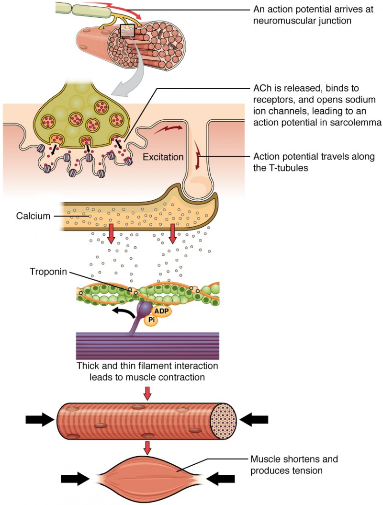

# Bones Don't Move Themselves

> **Core Thesis**: Bones are passive structures. They do not initiate movement, correct alignment, or decide where force goes. If a bone is out of position, the problem is not the bone—it is the forces acting on it over time.

---

## Quick Reference

| Principle | Insight |
|-----------|---------|
| **Bones** | Inert structures, respond to force |
| **Movers** | Muscles, ligaments, tendons, fascia |
| **Controllers** | Nerves, neural programming |
| **Alignment** | Result of force balance, not static position |
| **Correction** | Change the forces, not the bone position |

---

## The Fundamental Truth

Bones:
- Do not initiate movement
- Do not correct alignment
- Do not decide where force goes

**Bones respond.**

If a bone is out of position:
- The problem is NOT the bone
- The problem is the **forces acting on it over time**

---

## What Actually Moves Bones

### The Chain of Command


*The cascade from neural signal through acetylcholine release at the neuromuscular junction to muscle fiber contraction.*
*(Source: Chapter 3 - Fascial Bunching & the Kinetic Chain, Page 34)*

```
Neural Programming
       ↓
Nerve Signals
       ↓
Muscle Contraction
       ↓
Force Through Fascia/Tendons
       ↓
Bone Movement
```

### Force Generators

| Tissue | Function |
|--------|----------|
| Muscles | Active force production |
| Tendons | Force transmission to bone |
| Ligaments | Joint stabilization |
| Fascia | Force distribution and transmission |

All guided by **nerves**, which transmit **electrical signals** based on **neural programming**.

---

## Muscles Do Not Pull Straight

### The Misleading Anatomy Chart

Traditional view: origin → insertion → straight pull

Reality:
- Muscle fibers spiral
- Fascial sheaths wrap
- Force vectors change with joint angle
- Muscles transmit force across joints they don't cross

### Vector Fields, Not Lines

| Traditional | Reality |
|-------------|---------|
| Single direction pull | Vector field (compression + shear + torque) |
| Linear force | Multi-directional force |
| Independent action | Combined muscle vectors sum |

> "When multiple muscles fire together, their vectors sum. When they fire asymmetrically, torque accumulates. Over time, torque wins."

---

## Why Forcing Alignment Fails

### Temporary Repositioning

Manual manipulation can temporarily reposition a joint.

**BUT**: Unless the force environment changes, the joint returns to its previous state.

> "This is not failure of technique. It is physics."

### The Physics Rule

A joint will always migrate toward:
- Path of least resistance
- Greatest tension bias

If one muscle group dominates and its antagonist is neurologically inhibited:
- Bone drifts back
- Posture collapses again
- Pain recurs

### Why Relief Doesn't Last

| What Happened | Why It Failed |
|---------------|---------------|
| Immediate relief | Structure was moved |
| Pain returns hours/days later | Drivers were not addressed |
| Need repeated treatment | Force environment unchanged |

---

## The Real Rule of Alignment

Bones go where:
- Force is repeated
- Tension is dominant
- Neural patterns are habitual
- Fascia permits glide (or doesn't)

> "To change alignment, you must change the rules governing force, not the position of the bone."

---

## Why Stretching Alone Often Makes Things Worse

### Muscles Are Tight for Reasons

| Reason | Purpose |
|--------|---------|
| To stabilize unstable joints | Protective bracing |
| To compensate for inhibited muscles | Taking over slack |
| To protect vulnerable tissues | Guarding |
| To maintain balance under asymmetrical load | Counterweight |

### When You Stretch a Stabilizer

| What Happens | Result |
|--------------|--------|
| Joint becomes less stable | More vulnerable |
| Nervous system increases tone elsewhere | New tightness |
| Symptoms migrate | "The pain moved somewhere else" |

> "The system is rebalancing force—not healing."

---

## Neuromuscular Priority Overrides Strength

### Strength ≠ Control

The nervous system recruits muscles based on:
- Safety (first priority)
- Habit (familiar patterns)
- Past injury (protective programming)
- Perceived threat (danger assessment)

### Timing Beats Strength

| Factor | Impact |
|--------|--------|
| Weaker muscle, fires on time | Outperforms |
| Stronger muscle, fires late | Underperforms |

> "Chronic misalignment is often a timing problem, not a strength problem."

### Until Motor Recruitment Order Is Restored

| Intervention | Result |
|--------------|--------|
| Strengthening | Reinforces dysfunction |
| Stretching | Destabilizes |
| Manual correction | Fails to hold |

---

## Force Accumulation Over Time

Most chronic pain is NOT caused by single traumatic event.

It is caused by **micro-load mismanagement**.

### The Math

| Factor | Effect |
|--------|--------|
| 5% asymmetry in muscle tone | Small imbalance |
| × thousands of steps per day | Repeated force |
| × months or years | Accumulated adaptation |

### Result: Tissue Adaptation

| Adaptation | Mechanism |
|------------|-----------|
| Collagen remodeling | Tissue restructures |
| Fascial thickening | Web densifies |
| Altered proprioception | Sensation changes |
| Neural sensitization | Threshold drops |

> "By the time pain appears, the body is not 'breaking down.' It has already adapted to survive under poor force conditions."

---

## What True Structural Change Requires

### The Five Requirements

1. **Reduce aberrant tension** - Release excessive holding
2. **Restore fascial glide** - Free the tension web
3. **Re-center joints dynamically** - Not static positioning
4. **Reprogram motor patterns** - Change timing and recruitment
5. **Maintain coherence under load** - Function, not just position

> "Anything less is temporary."

---

## Key Quote

> "Bones do not move themselves. They go where force is repeated, tension is dominant, neural patterns are habitual, and fascia permits glide—or does not."

---

## See Also

- [Tensegrity](tensegrity.md) - How the body maintains stability through tension
- [Fascial Bunching](fascial-bunching.md) - When the tension web adapts poorly
- [Joint Centration](joint-centration.md) - Optimal joint positioning under load
- [Kinetic Chain](kinetic-chain.md) - How force travels through connected structures
