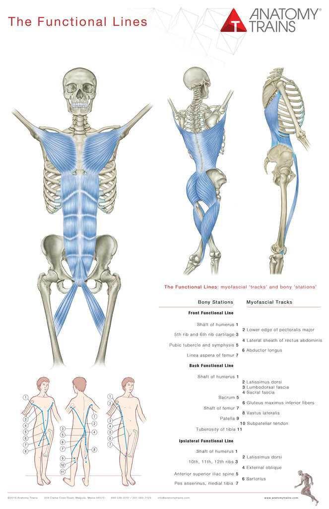
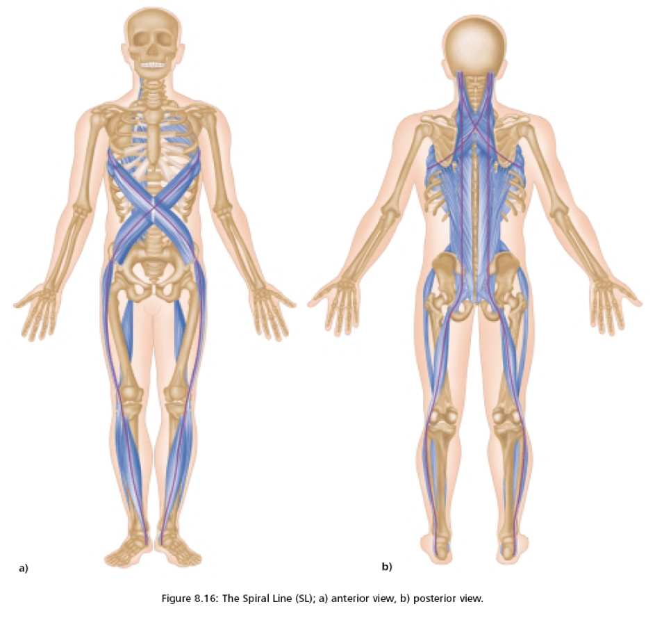

# Fascial Bunching

> **Core Thesis**: Fascia is not packaging—it is a load-sharing network. When one muscle underperforms, fascia doesn't "fail"—it reorganizes by binding adjacent tissues together. This creates stiffness that feels "deep" and unresponsive.

---

## Quick Reference

| Property | Description |
|----------|-------------|
| **Fascia** | Continuous connective tissue web |
| **Function** | Force transmission, not just wrapping |
| **Bunching** | Adaptive binding when muscles underperform |
| **Effect** | Couples muscles that should act independently |
| **Sensation** | Deep, unresponsive stiffness |

---

## Fascia: The Force Multiplier

### What Fascia Is NOT
- Packaging
- Passive wrapper
- Inert tissue

### What Fascia IS
- Load-sharing network
- Active force transmitter
- Continuous tension web

---

## Key Mechanical Properties of Fascia

| Property | Description | Implication |
|----------|-------------|-------------|
| **Tensile strength** | Comparable to steel (relative to size) | Transmits enormous force |
| **Viscoelastic** | Time-dependent deformation | Adapts to sustained load |
| **Piezoelectric** | Responds to mechanical force | Generates electrical signals |
| **Force transmission** | Can transmit force at distance | Remote effects possible |

---

## What Is a Fascial Bunch?

When one muscle underperforms, fascia doesn't fail—it **reorganizes**.

### The Bunching Process

```
Muscle underperforms
        ↓
Fascia maintains tension continuity
        ↓
Adjacent tissues bind together
        ↓
Fascial Bunch forms
```

### Characteristics of a Fascial Bunch

| Feature | Description |
|---------|-------------|
| **Couples muscles** | Muscles that should act independently become linked |
| **Transmits force** | Force travels across unintended pathways |
| **Creates stiffness** | Feels "deep" and unresponsive to stretching |
| **Persists** | Doesn't release with standard stretching |

---

## When Fascia Becomes Dysfunctional

### Triggering Conditions

| Condition | Effect on Fascia |
|-----------|------------------|
| Dehydration | Loses glide |
| Chronic tension | Thickens |
| Immobility | Adheres to adjacent structures |
| Injury/inflammation | Scar tissue forms |
| Repetitive strain | Adapts by binding |

### Consequences

| What Happens | Result |
|--------------|--------|
| Force transmission becomes uneven | Some areas overloaded |
| Muscles lose independent action | Movement becomes coupled |
| Load bypasses designed pathways | Compensation patterns |
| Compensation spreads globally | Whole-body effects |

---

## Remote Effects of Fascial Restriction

Because fascia forms a continuous web:

| Restriction In | Can Affect |
|----------------|------------|
| Hip fascia | Knee tracking |
| Rib | Shoulder stability |
| Jaw | Pelvic tone |
| Foot | Hip mechanics |

> "This is not metaphorical. It is mechanically demonstrable."

---

## Fascial Lines (Anatomy Trains)


*The Functional Lines showing front, back, and ipsilateral myofascial tracks with their bony stations.*
*(Source: Chapter 3 - Fascial Bunching & the Kinetic Chain, Page 19)*

### Major Lines

| Line | Path | Function |
|------|------|----------|
| **Superficial Front Line** | Toes → pelvis → chest → skull | Flexion, front body |
| **Superficial Back Line** | Heel → back of legs → spine → skull | Extension, back body |
| **Lateral Line** | Foot → outer leg → side body → skull | Side bending, stability |
| **Spiral Line** | Crosses body in helical pattern | Rotation, counter-rotation |
| **Deep Front Line** | Inner arch → inner leg → spine → skull | Core stability, breath |

### Functional Lines

| Line | Function |
|------|----------|
| **Front Functional** | Arm → opposite leg (throwing) |
| **Back Functional** | Arm → opposite leg (pulling) |

Force travels along these lines—restriction anywhere affects the whole line.

---

## Spiral Mechanics: The Hidden Distorter


*The Spiral Line wraps around the body in a helical pattern, demonstrating rotational force transmission through fascia.*
*(Source: Chapter 3 - Fascial Bunching & the Kinetic Chain, Page 20)*

Human movement is spiral-based:
- Walking
- Breathing
- Throwing

Each relies on opposing rotational forces.

### When One Spiral Dominates

| Problem | Result |
|---------|--------|
| Joints twist instead of hinge | Abnormal motion |
| Cartilage experiences shear | Wear and tear |
| Fascia tightens to control chaos | Bunching |

> "Degeneration accelerates where rotation is trapped."

---

## Why Standard Treatment Often Fails

### Stretching a Fascial Bunch

| What You Expect | What Actually Happens |
|-----------------|----------------------|
| Tissue lengthens | Bunch resists |
| Relief | Temporary at best |
| Lasting change | System compensates elsewhere |

### Why It Doesn't Work

- Bunching is **adaptive**—the body created it for a reason
- Stretching doesn't address **why** the muscle underperformed
- Force still needs to go somewhere

### What's Needed Instead

1. Identify why the muscle underperformed
2. Restore that muscle's function
3. Allow fascia to reorganize naturally
4. Retrain movement patterns

---

## Identifying Fascial Bunching

### Clinical Signs

| Sign | Indication |
|------|------------|
| Deep, unresponsive stiffness | Fascial, not muscular |
| Doesn't stretch out | Adaptive binding |
| Affects movement in multiple planes | Multiple muscles coupled |
| Remote symptoms | Force transmission along fascial lines |

### Palpation Findings

| Finding | Meaning |
|---------|---------|
| Thickened tissue | Fascial adaptation |
| Reduced glide | Layers adhered |
| Temperature changes | Circulation affected |
| Asymmetrical resistance | Uneven tension |

---

## Restoring Fascial Function

### Principles

| Principle | Application |
|-----------|-------------|
| Hydration | Internal and manual (technique) |
| Sustained pressure | Time-dependent release |
| Movement | Restore glide between layers |
| Address driver | Why did muscle underperform? |
| Global perspective | Trace along fascial lines |

### Techniques That Address Fascia

| Category | Examples |
|----------|----------|
| Manual therapy | Myofascial release, structural integration |
| Movement | Yoga, Pilates, specific fascial training |
| Tools | Foam rolling, balls (with proper technique) |
| Hydration | Water intake, tissue loading |

---

## Key Quote

> "A restriction in the hip fascia can alter knee tracking. A rib restriction can destabilize the shoulder. A jaw restriction can alter pelvic tone. This is not metaphorical. It is mechanically demonstrable."

---

## See Also

- [Tensegrity](tensegrity.md) - The body as tension structure
- [Kinetic Chain](kinetic-chain.md) - How force travels through connected structures
- [Bones Don't Move Themselves](bones-dont-move.md) - Why alignment depends on soft tissue
- [Joint Centration](joint-centration.md) - Optimal joint positioning
