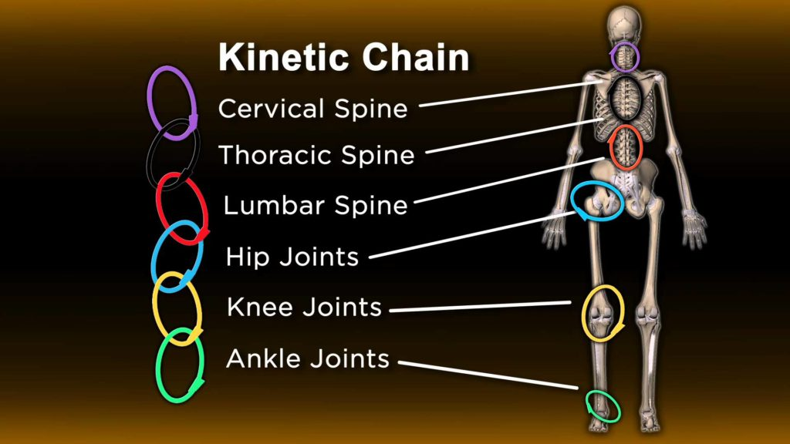

# Kinetic Chain

> **Core Thesis**: The body moves in chains, not joints. When one link fails to manage load, another absorbs it. Pain appears where force accumulates, not where it originates.

---

## Quick Reference

| Principle | Insight |
|-----------|---------|
| **Chain** | Connected series of joints and tissues |
| **Load transfer** | Force passes through the chain |
| **Weak link** | When one fails, another compensates |
| **Pain location** | Where force accumulates |
| **Treatment focus** | Find the failing link, not just pain site |

---

## What Is a Kinetic Chain?


*The kinetic chain connects cervical spine, thoracic spine, lumbar spine, hip joints, knee joints, and ankle joints.*
*(Source: Chapter 3 - Fascial Bunching & the Kinetic Chain, Page 23)*

A kinetic chain is the interconnected series of:
- Joints
- Muscles
- Fascia
- Nerves

That work together to produce or control movement.

### Key Principle

> "The body moves in chains, not joints. When one link fails to manage load, another absorbs it."

---

## Common Kinetic Chain Patterns

| Chain | Links | Common Dysfunction Flow |
|-------|-------|-------------------------|
| **Lower extremity** | Foot → ankle → knee → hip → pelvis → spine | Foot dysfunction → knee pain |
| **Upper extremity** | Hand → wrist → elbow → shoulder → scapula → spine | Rib restriction → shoulder pain |
| **Core/Spiral** | Jaw → neck → thorax → pelvis | Jaw tension → pelvic dysfunction |

---

## Pain Location vs. Origin

### The Core Insight

| Where Pain Shows Up | Where Problem Often Is |
|---------------------|------------------------|
| Knee | Foot, hip |
| Shoulder | Rib, thoracic spine |
| Neck | Ankle, pelvis |
| Low back | Hip, diaphragm |
| Headache | Jaw, cervical spine |

> "Pain appears where force accumulates, not where it originates."

### Why This Happens

```
Link A fails to manage load
           ↓
Force redirects to Link B
           ↓
Link B absorbs extra load
           ↓
Link B tissues become irritated
           ↓
Pain signals at Link B
```

---

## Compensation Patterns

### How the Body Compensates

When one segment can't do its job:

| Original Function | Compensation |
|-------------------|--------------|
| Hip rotation | Spine rotates instead |
| Ankle dorsiflexion | Knee hyperextends |
| Thoracic extension | Lumbar hyperextends |
| Scapular stability | Neck muscles overwork |

### The Nervous System Priority

> "The nervous system will sacrifice comfort to preserve movement."

The body will:
1. Complete the movement task
2. Protect vital structures
3. Use whatever tissues are available
4. Ignore pain until it can't

---

## Assessing the Kinetic Chain

### Questions to Ask

| Question | What It Reveals |
|----------|-----------------|
| What movements provoke pain? | Which chain is involved |
| Where does compensation appear? | Which links are overworking |
| What's stiff or immobile? | Which links are failing |
| What's the history? | Original dysfunction |

### Common Findings

| Finding | Likely Meaning |
|---------|----------------|
| Joint above/below is stiff | That joint is driver |
| Pain site is hypermobile | Compensating for stiff segment |
| Old injury upstream | Source of chain disruption |
| Remote stiffness | Fascial connection |

---

## The Spine as Central Hub

The spine connects upper and lower chains:

```
Upper Extremity Chain
         ↓
    Cervical Spine
         ↓
    Thoracic Spine ← Rib cage
         ↓
    Lumbar Spine
         ↓
Lower Extremity Chain
```

### Spinal Compensation

| If This Segment Is Stiff | This Segment Compensates |
|--------------------------|--------------------------|
| Thoracic spine | Cervical, lumbar |
| Hips | Lumbar spine |
| Shoulders | Cervical spine |
| Pelvis | Lumbar spine |

---

## Upper vs. Lower Chain Dysfunction

### Lower Chain (Ascending)

| Dysfunction | Effects |
|-------------|---------|
| Foot pronation | Tibial rotation → knee valgus → hip shift |
| Ankle restriction | Knee hyperextension → hip anterior glide |
| Hip stiffness | Lumbar rotation → thoracic compensation |

### Upper Chain (Descending)

| Dysfunction | Effects |
|-------------|---------|
| Jaw tension | Cervical hypertonicity → shoulder elevation |
| Rib restriction | Scapular dysfunction → shoulder impingement |
| Thoracic kyphosis | Cervical lordosis → headaches |

---

## Breaking the Chain of Dysfunction

### Ineffective Approach

| Action | Why It Fails |
|--------|--------------|
| Treat pain site only | Driver still present |
| Strengthen painful area | Reinforces compensation |
| Stretch tight compensator | Removes protective tension |

### Effective Approach

| Step | Action |
|------|--------|
| 1 | Map the entire chain |
| 2 | Identify the failing link |
| 3 | Restore function at driver |
| 4 | Retrain chain coordination |
| 5 | Allow compensation to resolve |

### Key Principle

> "Pain is the receipt, not the cause."

---

## Clinical Examples Summary

| Pain Location | Driver Found | Resolution |
|---------------|--------------|------------|
| Knee | Foot pronation, hip anterior glide | Foot/hip correction |
| Shoulder | Rib restriction, diaphragm asymmetry | Rib mobility restored |
| Neck | Ankle instability, pelvic rotation | Ankle proprioception |
| Hip | Thoracic rotation locked | Rotational balance restored |

For detailed case studies, see:
- [Case: Perfect MRI Knee](../case-studies/case-perfect-mri-knee.md)
- [Case: Frozen Shoulder](../case-studies/case-frozen-shoulder.md)
- [Case: Chronic Neck Pain](../case-studies/case-chronic-neck-pain.md)

---

## Key Quotes

> "The body moves in chains, not joints."

> "Pain appears where force accumulates, not where it originates."

> "The nervous system will sacrifice comfort to preserve movement."

---

## See Also

- [Fascial Bunching](fascial-bunching.md) - How fascia adapts within chains
- [Tensegrity](tensegrity.md) - Global force distribution
- [Body as System](../concepts/body-as-system.md) - System-wide interconnection
- [Joint Centration](joint-centration.md) - Optimal joint function within the chain
